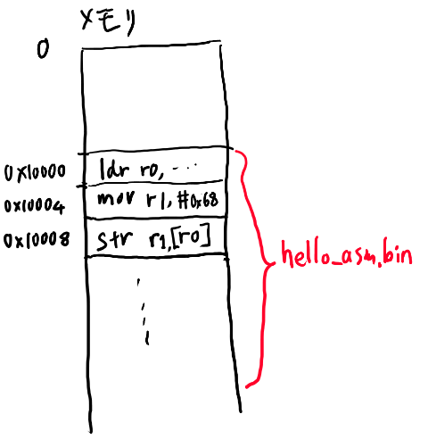
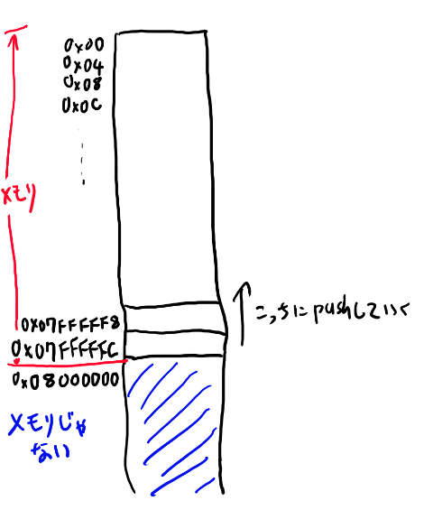
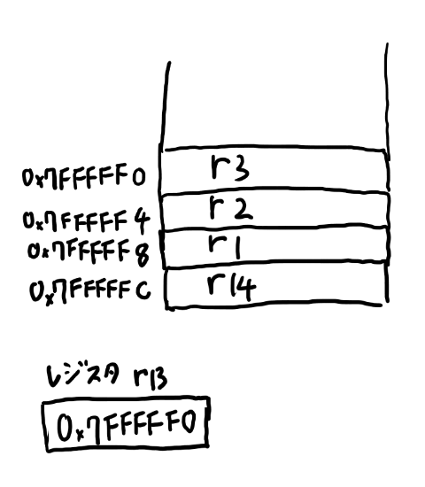
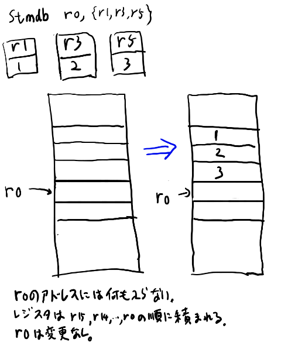
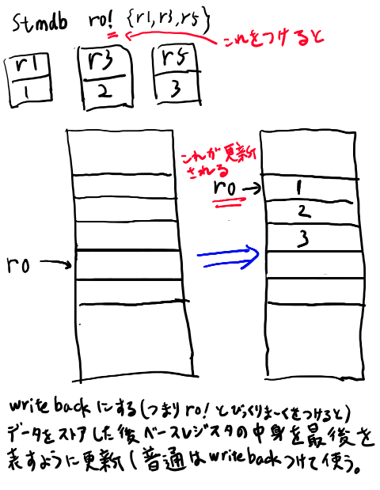
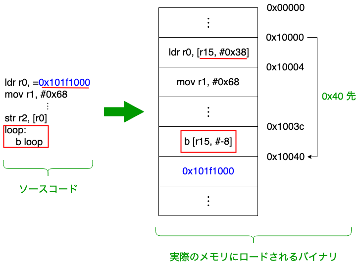

<style>
   .column{
        padding: 0.5em 1em;
        margin: 2em 0;
        color: #5d627b;
        background: white;
        border-top: solid 5px #5d627b;
        box-shadow: 0 3px 5px rgba(0, 0, 0, 0.22);
    }
</style>


第二回はQEMUを使ってARMのバイナリを動かしたり、バイナリを生成したりディスアセンブルしたりするコードを書きます。

OSの無い環境でプログラムを動かす事で、C言語の土台の理解を深める事を目的とします。

- QEMUのベアメタル環境を使えるようになる
- nm, readelf, objcopy, objdumpなどのコマンドに慣れ親しむ
- 簡単なARMのアセンブリを理解する
- 簡単なアセンブラとディスアセンブラを作る
- Cコンパイラの吐くアセンブリ言語を調べる事でC言語の理解を深める

# 何故アセンブラと逆アセンブラを作るのか？

C言語を勉強しよう、という時に、なんだか関係ない別の言語に見えるアセンブラ言語を学ぼうというのは「なんでよ！？」と思うかもしれません。

そこでここではまず、今回QEMUを使ってバイナリを動かしたり簡易アセンブラや逆アセンブラを作るモチベーションを説明したいと思います。

### C言語を理解するにはアセンブリを知っている方がいい

C言語はアセンブリ言語を知らなくても理解出来ます。
ですが、C言語はアセンブリ言語との親和性が高く、アセンブリ言語の理解があるとずっと出来る事も増えます。

C言語のコンパイラは、アセンブリ言語を生成するようになっています。
この生成されるアセンブリを調べる事で、C言語だけでは分かりにくい仕組みなどが良く分かるようになります。

また、初めて低レベルな事をやる時にはobjdumpやobjcopyなど多くのコマンドが一気に出てきて、
実際は大した事無い事でもなんだかすごく圧倒されてしまいがちです。
一度どこかで簡単な題材に対してobjdumpなどを使った経験を持っておくと、
そうした時にもひるまずに済みます。

### バイナリの処理の勉強になる

C言語に一番向いた処理、というのはバイナリを扱う処理だと思います。
逆アセンブラやアセンブラなどはバイナリ処理の代表的な構造を持っているので、
バイナリ処理の練習に適しています。

バイナリ処理はだいたい似たような構造となるので、どれか一つでやった事があるかどうかの差は大きい。
そういう訳でバイナリ処理の題材として手頃なのでやってみよう、というのがあります。

### 低レベルなプログラムは楽しい！

C言語の楽しさといえば低レベルプログラミングでしょう。
低レベルプログラムは、C言語の楽しさの割と中心的な所だと思います。（著者の個人的見解です）

特に規模の小さい低レベルプログラムが楽しい。
規模の小さい低レベルプログラミングは隅から隅まで理解出来ます。
これはプログラムにおいて低レベルプログラムだけでしか味わえない楽しさです。

一方で最近は低レベルでも皆大きなものを作りたがりがちで、
本などを買って来て読んでも、あまりこの楽しさは味わえません。
やはり簡単な例でバイナリを隅から隅まで理解する、というのは、
C言語を学ぶなら一回くらいやっておいてもいいでしょう。

### 何故ARMなのか？

最初x86でこの回を作る気だったのですが、x86のアセンブリ言語は歴史的事情からいろいろ複雑な仕組みになっている為、説明がややこしくなります。

一方ARMはいろいろな事が単純になっている為、低レベルの事を勉強するには手頃なターゲットとなっています。
また、C言語を書く必要があるシチュエーションではARMをターゲットにする方が今ではむしろ多いと思うので、実用性という観点からもARMを覚えておくのは悪くない、と思いARMをターゲットとしました。


# 01 QEMUの環境を作ろう

以下Windows 10のWSLを前提にします。昨今ではたいていの環境で似たり寄ったりのパッケージシステムがあるでしょう。

初回は環境設定を主な目的としています。これらが何を意味しているかについては、おいおい説明していきます。

### QEMUとARM用gccをインストール

今回はARM用のQEMU環境であるqemu-system-armと、ARM用のクロスコンパイルのためのパッケージであるgcc-arm-embeddedをインストールします。

```
sudo add-apt-repository ppa:team-gcc-arm-embedded/ppa
sudo apt update
sudo apt install gcc-arm-embedded

sudo apt install qemu-system-arm
```

### バイナリエディタをインストール

今回はバイナリの中身を調査する為、何らかのバイナリエディタを入れる事がオススメです。
大したサイズじゃないのでodコマンドなどで頑張ってもいいんですが、
今回はバイナリエディタをインストールする事にします。

なんでもいいんですが、私は最近はBz Editorに落ち着きました。

https://github.com/devil-tamachan/binaryeditorbz

試しに以下で出来るhello_arm.binをバイナリエディタで開いてみて下さい。

### hello_arm.sを動かしてみよう

sources/arm_asm/01_qemu_setup/hello_arm.s

に、UARTにhelloと表示するアセンブリが書いてあります。これを動かしてみましょう。

```
$ arm-none-eabi-as hello_arm.s -o hello_arm.o
$ arm-none-eabi-ld hello_arm.o -Ttext 0x00010000 -o hello_arm.elf
$ arm-none-eabi-objcopy hello_arm.elf -O binary hello_arm.bin
$ qemu-system-arm -M versatilepb -m 128M -nographic -kernel hello_arm.bin -serial mon:stdio
```

終了はC-a xです。
これは

1. 「Ctrlを押しながらaを押す」
2.「両方離す」
3. 「その後xを押す」

という意味です。

# 02 ARM アセンブリ入門

さて、前回はhello_arm.sというアセンブリ言語で書かれたプログラムを動かしました。
今回はこのアセンブリ言語について、簡単な入門をしていきたいと思います。

ARMのアセンブリの入門なんてweb上にいくらでもありそうだと思うのですが、どうもググっても手頃なのが見つからないので、自分で書く事にしました。

**アセンブラ？アセンブリ？**  
まず正しい定義としては、アセンブリ言語が正しい呼称でしょう。
そしてアセンブリ言語をバイナリにする為のツールがアセンブラとなります。
コンパイルする言語がコンパイラなのと同様です。  
　  
ただ最近の若い人は普通にアセンブラ、と言いますよねぇ。アセンブリ、とわざわざいうのはどっちかと言えば頭の硬いおっさん、って感じがして、どうなのか、という気もします。
この手の語源警察とかろくでも無い、と普段から思っているので。  
　  
ただ他人がアセンブラと言っているのは別に良いのですが、どうしても自分が言語の名前をアセンブラと呼ぶのには抵抗があるので、このシリーズではアセンブリと呼ぶ事にします。おっさん乙…
{: .column}

## アセンブリについての話題など

まずは言語自体の話に入る前に、周辺の雑談などからしてみたいと思います。
というのはアセンブリ言語というのはちょっとそれ以外の言語とは違う所が多いと思うからです。

実際のお勉強を重視する人は読み飛ばしてOKです。

### アセンブリ言語は難しい？簡単？

アセンブリ言語は、ソフトウェア開発者だとだいたいtwitterでイキるのに使われる程度です。
いわく「Cはマクロアセンブラにすぎないから（キリッ」とか、「低レベルな方がわかりやすいので、ポインタが分からない人はアセンブリを先にやるとすぐ分かるよ（キリッ」とかそういう感じです。鬱陶しいですね。
彼らは別にアセンブリ自体の話はあんまりしない。

だいたいイキるのに使われるというのは、難しくて高度な事、という印象があるのでしょう。
実際、ソフトウェア開発者にとって、アセンブリ言語を理解するのは、難しい部分があります。

一方でアセンブリ言語が難しいか？というとそうでもありません。
あくまで「ソフトウェア開発者にとって」難しいのであって、
それ以外の人にとってはそんな難しくない、という事があります。
具体的にはハードウェア開発者などにはアセンブリ言語の方が簡単でしょう。

これはアセンブリ言語が、より抽象度が低いからです。下のハードウェアに近いので、下のハードウェアの知識があると、言語自体は大した事をしてないので理解が簡単です。

ハードウェアの知識、なんてなんか高度で難しそう！と思うかもしれませんし、
実際高度で難しいと思いますが、アセンブリ言語が難しい、というのはちょっと違う気もする。

抽象度が低い、というのは、思考としては逆に高度「では無い」という事だと思います。
この高度な思考を「捨てる」のが、高度で抽象的な思考に慣れているソフトウェア開発者にとってはちょっと難しい、
というか珍しい必要性を要求される所で、そこがアセンブリ言語の特殊さでもあります。

ただ抽象的じゃない、というのは、理解してしまえば難しさはそれほどはありません。
実際、アセンブリ言語「しか」理解出来ないという人は結構います。
ただそういう人はだいたいもう老人でweb上にはあんまり居ないので、

アセンブリ言語が出来る人＝＝そのほかの事もなんでもしってるすごい人

になりがちというだけです。

### アセンブリ言語は言語なのか？

C言語はプログラム言語です。これは皆が納得する事でしょう。
RubyでもPythonでもJavaでもKotlinでも、これらがプログラム言語なのは明らかで、
このプログラム言語についてある程度は説明する事も出来ます。

ですが、アセンブリ言語、というのは、「これがアセンブリ言語です」という意味でのアセンブリ言語は無い。
実際は「ARMのアセンブリ言語」とか「x86のアセンブリ言語」とかになります。
（さらにNASMとかgasとかありますが、それはおいとく）。

アセンブリ言語という単体の物は実際には存在していません。
それぞれCPUごとに別々の言語があります。
そしてこれらの言語は、CPUの機能を、ほぼそのまま書いているだけだったりします。
だから、あるCPUの機能を理解する事と、アセンブリ言語の理解は、ほぼ同じ事を指します。

ここがアセンブリ言語の特殊な所です。プログラム言語単体だけでの理解、というのがアセンブリ言語は出来ない。
逆にCPUの構造を理解するとアセンブリの理解も98%くらい終わってしまいます。
だからアセンブリ言語を勉強しよう、という時は、CPUの機能を勉強しよう、という事と同じなのです。
そしてCPUはそれぞれ別なので、どのCPUを勉強するか、という話になります。

言語という名前がついているけれど、実際はCPUの機能とほとんど同じ、という所がアセンブリ言語の特殊な所です。
CPUの機能とは独立した、抽象概念としての言語の実在があまり無い。
だから「とりあえずアセンブリ言語の基礎的な事だけ知りたいんだ。個々のCPU的な話には踏み込まずに解説している物は無いかな？」という気持ちで本屋やwebを探しても、全滅する事になります。

ただ、実際はいろいろなCPUは、それぞれかなり似通っています。
だから、一つのCPUを理解すると他のCPUも比較的簡単に学ぶ事は出来ます。
ですから、一つのアセンブリ言語を知っていると、アセンブリ言語を知っている、と言えない事も無い。

なお、このシリーズでは以下、特に指定無く「アセンブリ言語」と言ったら、ARMのアセンブリ言語を指すとします。

### アセンブリ言語は突然膨大な詳細情報が出てきがち

アセンブリ言語というのは、CPUを動かす為のバイナリと一対一に近い対応をしています。
完全に一対一では無くて、多対一で、アセンブリ言語の方が多ですが。
逆像は存在するので、どれかの元を選ぶ事で、逆アセンブルが出来る。

さて、CPUを動かすバイナリ、とは、要するにCPUにつながっている線のすべての電圧の組となります。
基本的には前のクロックに特定の電圧の組があると、次のクロックではある一定の電圧の組に変える、
というのがCPUの機能です。
この対応は完全に一意で、入力時の電圧を決めると、次のクロックは完全に決まります。

だから、原理的にはこの対応関係を全部記述すれば、分からない事はありません。
そこでアセンブリ言語のマニュアルというのは、
ある程度構造化された形でこの全対応を書いてあるものです。

これを調べれば全てが分かる。必要な事は全て書いてあって要らない物は無い。
素晴らしい。

これが他の言語を知っているソフトウェア開発者には辛い所です。
大量の詳細な情報がぶわーっと一気に出てくる。
ゆとりとしては、もっとこう、基礎的な所だけでまずはハローワールドとか書きたいのですが、
アセンブリ言語の情報というのは最初から全てを含んだpdfのみ、となりがちです。

そもそもにアセンブリ言語には説明すべき抽象概念があまり無く、
そこにあまり抽象的思考とかしないハードウェア開発者が書くという事があいまって、
ひたすら詳細が並んでるだけ、となってしまうのです。

そして実際、慣れてしまえばこれだけで十分でもあります。

結果として、大して難しくは無いのだけどとっつきにくい為、twitterでイキるのに使われてしまったりする。
悲しい事です。

### このシリーズでは、C言語に必要な程度だけ話す

私はそもそも、そんなにアセンブリ言語詳しくありません。
C言語を理解するには十分な知識を持っているつもりですが、ハードウェア屋とか低レベルプログラマの人たちに比べると、
だいぶ理解は浅い。

そこで今回も、アセンブリ言語のシステマティックで全体的な入門を書く気はありませんし、書く能力もありません。
その代わり、C言語の理解を深めるのに必要な範囲+アルファくらいの解説に留めようと思います。
ソフトウェア開発者にとってはアセンブリ言語の良い入門にもなると思いますが、
ちゃんと学ぶ時にはよそでお願いします。

ただ、この目的を絞っている方が、最初に全ての詳細が出てきてしまう、
という問題を回避出来るんじゃないか、と思っていますし、
解説としてもゆとりにも優しい感じを目指していきます。


## 2.1 hello_asm.sを読む

ではhello_asm.sを読んでいく事で、アセンブリ言語の説明をしていきたいと思います。

まずはコードを見てみましょう。

```
.globl _start
_start:
    ldr r0,=0x101f1000
    mov r1,#0x68
    str r1,[r0]
    mov r1,#0x65
    str r1,[r0]
    mov r1,#0x6c
    str r1,[r0]
    mov r1,#0x6f
    str r1,[r0]
    mov r2,#0x0D
    str r2,[r0]
    mov r2,#0x0A
    str r2,[r0]
loop:
    b loop
```

開幕はむしろ難しいのがアセンブリの勉強の難しい所ですね。
個々の説明に入る前に、全体的な話から。

### 行の3つの種類

アセンブリ言語の行は、大きく3つの種類の行に分けられます。

1. 疑似命令（.で始まる。この例では.global _startだけ）
2. ラベル （文字列のラベルとコロンで指定される。この例だと_start:とかloop:とか）
3. 命令（実際のコード。movとかldrとかの行）

疑似命令はバイナリを生成する時に使われる特殊な物で、CPUの命令とは違う物です。
バイナリデータを埋め込んだり生成されるバイナリのアラインメントを調整したり、
といった、生成されるコードについての指示が主に行われます。

ラベルはジャンプ文などで参照する為の物です。最終的に生成されるバイナリには含まれません。
アセンブリ言語からの参照の目的で使われます。

最後の命令の行が、実際のCPUの命令になります。これがアセンブリ言語の本体です。

アセンブリのプログラムは、基本的には最初の命令から一つずつ実行されていきます。
ラベルがあっても関係なく次の命令に行きます。ここはちょっと慣れが要る所ですね。

### 命令の3つの種類

命令には大きく

1. レジスタとメモリの間のデータのやり取り
2. レジスタ同士の計算
3. ジャンプ

の3つがあります。

さて、レジスタというのが出てきました。初めて見る人も居るでしょう。
レジスタというのはCPUに直接つながっている、32ビットの数値を覚える領域、という感じです。
アセンブリプログラムからすると、レジスタというのはintのグローバル変数のような物です。
CPUごとに数が決まっていて、ARMではとりあえず16個のレジスタがあります。
これにはrで始まる名前がつけられていて、
r0からr15までの名前で識別出来ます。
（本当は他に状態フラグ用のレジスタもありますが、これは直接は触れないのでここでは考えません）

アセンブリ言語が一番変わってるのは、メモリの値に対しては、直接計算する事が出来ない所です。
アセンブリ言語においては、メモリは非常に遠くのデータベースのような存在で、
まずデータをレジスタに取ってきてからじゃないと使えません。

そこでアセンブリのプログラムは基本的に

- メモリから値をレジスタに移す
- レジスタ同士で計算する
- レジスタからメモリに値を戻す

という事を繰り返す事になります。

上記リストの1の、メモリとレジスタの間をやりとりするのがロードとストアです。
ロードはldr、ストアはstrという命令で表されます。strは文字列じゃないらしいです。
ロードでメモリから値を読み、ストアでメモリに値を書きます。
ゆとりな自分にはどっちがどっちか良くわからなくなります。

次にレジスタ同士の演算としては、このプログラムではmovしか使ってません。
これは引数を2つ取り、右側の値を左側にコピーする、という意味になります。
詳細は後で説明します。

最後はジャンプです。このプログラムではbという命令が使われています。
bは無条件にジャンプする、という事です。
このプログラムでは以下のようなコードで終わってますね。

```
loop:
    b loop
```

これはloopのラベルにジャンプする、という意味です。loopはまさにこの一行上なので、またこの行が実行されます。
つまりb loopが無限に実行されます。
C言語でいう所の

```
while(1){}
```

という意味ですね。ここで実行を止める事で、変な事をせずに待つ事が出来るようになります（高速にひたすらジャンプし続けるので電気的には無駄ですが）。


### movを簡単に見る

まずはmovを見てみましょう。例えばこんな行があります。

```
    mov r1,#0x68
```

movは普通は以下のように使います。

```
    mov r1,r2
```

これでレジスタr2の中身を、レジスタr1にコピーする、という意味です。

ですが今回のコードでは、このr2に相当する部分が、「#0x68」となっていますね。
この#で始まるのは即値と言われるもので、小さな数字はこうやって直接レジスタを入れる所にレジスタの代わりに置く事が出来ます。

「小さな数字」というのがどこまで許されるかは命令ごとに決まってますが、だいたい数ビットの範囲です。
なお、どこまで許されているかは私は覚えてないので適当に書いてアセンブル時に怒られたりするのは良くあります。

とにかく、以下の命令で、

```
    mov r1,#0x68
```

r1には0x68が代入されます。

### ldrを簡単に見る


さて、最初の命令はこんな行になっています。

```
    ldr r0,=0x101f1000
```

イコールで始まる物の意味はちょっとややこしいんですが、プログラムのバイナリの下の方にイコール以下の数字を書き込んで、
そこへのアドレスの中身とする、みたいな意味になります。

TODO:あとで調べてちゃんと書く

0x101f1000 は数ビットの範囲には収まってないので即値では書けません。
そこでmov命令で代入する事は出来ないので、一旦この数値をバイナリに埋め込んで、その埋め込んだアドレスを読むように指定する必要があります。

めんどくさいですね。

この辺は後で実際にバイナリエディタで中を見る時によりちゃんと理解出来ると思うので、
この時点ではとにかくそういう物らしい、くらいで先に進んで下さい。

とにかく、これでr0レジスタには「0x101f1000」という数字が入ります。

この数字は何か？というと、メモリマップされたUARTのアドレスです。
メモリマップってなんだよ、とかUARTってなんだよ、とかいろいろ一気に出てくるのがアセンブリの面倒な所ですね。

ちょっとずつ見ていきましょう。

### versatilepb入門

さて、この0x101f1000というのが何なのか、
というのは、現在ターゲットにしているハードウェアの話になります。

我々はQEMUにversatilepbという物を指定しているので、QEMUはこのハードウェアをエミュレートしています。

versatilepbというのは、自分もあまり詳しくないですがARM926EJ-SのCPUが載った評価ボードですかね。
ARM926EJ-Sは結構ライセンス料が安くてダイが小さいという事で、
非力なマシンにとりあえず載せておくCPUとして広く普及しています（2018年現在）。

詳細は以下のサイトにありそうです（私があまり詳しくない）

[https://developer.arm.com/docs/ddi0198/latest/preface](https://developer.arm.com/docs/ddi0198/latest/preface)

まぁとにかく、ARMでとりあえず何か作る時には仮想的なターゲットとしてとりあえず良く使われる物と思っておけばよろしい。

で、このversatilepbのアドレス0x101f1000には、UARTという物が接続されています。
これはメモリマップドIOという物ですね。

### メモリマップドIOとは何か？

TODO: あとでちゃんと調べて書く

一般にハードウェアというのは、CPUと何かしらの形でつながっています。
で、CPUはこのハードウェアにつながってる線に電圧を掛けたり抜いたりする事で命令を送って操作します。

このCPUとハードウェアをつなぐ時の方式として、メモリのふりをしてつなげる、という方式があります。
これがメモリマップドIOです。
CPUからは特定のアドレスのメモリのように見えるんですが、
実はこれはメモリでは無くハードウェアを制御する線になっている、という訳です。

プログラムからはこのメモリのアドレスに値を書き込んだり読み込んだりする事で、ハードウェアを操作します。
プログラムからはメモリとの区別はつきません。
という事でプログラムからこのハードウェアを操作するには、メモリに値を書いたりメモリから値を読んだりする命令を使います。

メモリのアドレスに値を書いたり読んだりするのはロードとストアを使う、という話をしました。
メモリマップドIOでもこれを使います。

で、UARTは何か？というと、単純なシリアルポートの最近流行りのバージョン、くらいに思っておけばいいと思います。
このUARTに書いた物はそのままポートから取り出せて、ディスプレイなどにつなげると結果が見れたりします。
teratermとかkermitとか使います（たぶん）。

ポートとかシリアルポートとかわからん、というゆとりの低レベルプログラムとしては、UARTはデバッグ出力出す所、と思っておけば良いでしょう。

で、versatilelpbのメモリ空間では、アドレス0x101f1000はUARTにつながってる訳です。

なお、このアドレス以外のメモリマップドされてる物は、公式ドキュメントにも書いてありますがQEMUのソースを読む方が早い。

[github: QEMU versatilepb.c](https://github.com/hackndev/qemu/blob/master/hw/versatilepb.c)

ただUARTくらいしか今回は使いません。

### strを簡単に見る

hello_asm.sで最後に残ったのが、str命令です。例えば以下みたいな行があります。

```
    str r1,[r0]
```

ストア命令は、1つ目の引数の値を二つ目の引数のアドレスに書きこむ、という意味です。
r0が中括弧で囲まれているのは、「この中括弧で囲まれているレジスタの中身をアドレスとみなして、そのメモリのアドレスに書き込む」という意味の指定方法です。

こういうのは最初のうちは出てきた物だけ覚えて、ある程度慣れてきたら全ての指定方法を覚えるのがおすすめです。
最初は詳細情報が多すぎないように、出てきた物だけをコツコツと攻略していきましょう。

さて、r0は先程のロード命令で0x101f1000が入っているのでした。
だからこの命令で、r1の中身をアドレス0x101f1000に書き込む、という意味になります。

これで（疑似命令以外）だいたい全部の構成要素の説明が終わりました。
では全体としては、何が書いてあったのかを解読してみましょう。

### 文字の出力を解読する

まずは以下の三行を見てみましょう。

```
    ldr r0,=0x101f1000
    mov r1,#0x68
    str r1,[r0]
```

一行目でr0に0x101f1000が入ります。

2行目でr1に0x68が入ります。

三行目でr0のアドレスにr1を書き込みます。つまり0x101f1000に0x68を書き込みます。

このように、メモリの特定のアドレスに数字を書き込む、という事に、これだけの手順が必要になるのです。

ここまで来ると、以下のコードも読み解く事が出来ます。

```
    mov r1,#0x68
    str r1,[r0]
    mov r1,#0x65
    str r1,[r0]
    mov r1,#0x6c
    str r1,[r0]
    mov r1,#0x6f
    str r1,[r0]
    mov r2,#0x0D
    str r2,[r0]
    mov r2,#0x0A
    str r2,[r0]
```

r0が指すアドレスに、「0x68を書き込み、0x65を書き込み、0x6cを書き込み、0x6fを書き込み、0x0Dを書き込み、0x0Aを書き込む」訳です。

あとはアスキーコードの知識となります。第一回でパーサー書いた時に調べたでしょうか？（私は調べてません）

確か順番に'h' 'e' 'l' 'o'と、0x0D, 0x0Aを書いているのでしょうね。
最後2つは改行だったはず。（改行と復帰だっけ？まぁどうでもいい）

これで最後に残るのは.globalという疑似命令ですが、ここは説明するとややこしいので、おまじないと思っておいてOKです。

一応簡単に説明しておくと、_startというのはリンカにとって特別な意味を持ってて、バイナリの先頭をそこに配置するという意味があります。
そして、この.globalという疑似命令は、ラベルの情報を結果のバイナリにも残して、それをリンカから見えるようにする、という感じです。
あんまり気にしないでこういう物、と思っておけばOKです。

### hello_asm.sを読み終わって

さて、いかがでしたでしょうか。こんな何もしてないアセンブリでもなかなか説明する事が多いですね。
抽象化が弱いせいで、最初から全部が出てきてしまうのがアセンブリの辛い所です。

ただ基本的なアセンブリの要素はここまででもかなり説明出来ています。
コードをメモリとのやり取りとレジスタ内での計算の2つに読み解ければ、アセンブリはマスターしたも同然です。
実際ハードウェア屋にアセンブリ教えて、って頼むと、
この位から一気に詳細のデータシートを渡されて「あとはこれ読むだけだ」とか言いがちです。

ですが彼らはゆとりの気持ちが分からない連中なので気にしてはいけません。
我らはもうちょっとちまちま進む事にしましょう。

### hello_asm.sに出てきたニモニックまとめ

アセンブリではPostScriptでオペレータと言っていた物をニモニックと呼びます。ニモニックの意味は知りません。

で、ここまで出てきた物を簡単にまとめておきます


| ニモニック | 例 | 説明 |
| ---- | ----- | ------|
| **.global** シンボル | **.global _start** | シンボルをリンカに見えるようにする疑似命令 |
| **b** ラベル | **b loop** | ラベルにジャンプする |
| **ldr** レジスタ, メモリ | **ldr r1, =0x101f1000** | メモリの内容をレジスタに読み込む。イコールで書かれた長い数値などはどこかに埋め込んでそこへのアドレスに展開される（からレジスタには=で書いた値がそのまま入る） | 
| **mov** 結果レジスタ, 入力 | **mov r1, #0x68** | 入力を結果のレジスタにコピーする。入力は即値やレジスタなどが使える |
| **str** 入力レジスタ, メモリ | **str r1, [r2]** | 入力レジスタの中身をメモリの指定された場所にコピーする。メモリの指定は角括弧でアドレスの入ったレジスタをくくるなど |

### 課題: worldと表示してみよう

hello_asm.sをコピペして、world_asm.sを作りましょう。
そしてworldと表示してみて、コミットして見せてください。（まぁこの位なら見せなくてもいいです）

第二回のブランチのラベルは、asm_で始めて、あとはサブセクションの数字でどうでしょう？
例えば今回はなら、「2.1 hello_asm.sを読む」がサブセクションのタイトルなので、

asm_2_1_hello_asmなど。

別に他のラベルでも構わないのですが、ローマ字順でソートした時に（私が）第一回と区別出来るようにしておいて下さい。

## 2.2 print_loop.sを読もう

さて、hello_asm.sを極めた我々はアセンブリマスターとしてtwitterでイキる事が出来るようになりました。
しかし我らの志は高いので、そんな事では満足しません。

次にループのあるコードを読んでみましょう。

02_arm_assembly/2_2_print_loop/print_loop.sを読んでみます。

まずは読む前に実行してみてください。
「hello, world」と表示されたでしょうか？

コードは以下のようになっています。

```
.globl _start
_start:
    ldr r0,=0x101f1000
    ldr r1,=message
    ldrb r3,[r1]    
loop:
    str r3,[r0]
    add r1, r1, #1
    ldrb r3,[r1]
    cmp r3,#0
    bne loop
end:
    b end

message:
    .asciz  "hello, world\n"
```

では見ていきましょう。

### 疑似命令.asciz

まずは最後の行から。
最後のところに、出力している文字っぽい物が書いてあります。


```
message:
    .asciz  "hello, world\n"
```

このmessage:はラベルです。
.ascizというのは疑似命令ですね。

この.ascizというのは、その後の文字列をそのまま埋め込んで、最後にヌル文字（つまりバイト0)を入れる、
という物です。

埋め込むというのが何を指すのかは後でバイナリエディタで見てみる所まで行くとより詳細に分かると思うので、
ここでは簡単に解説するにとどめます。

アセンブリ言語というのは、あとで見ていきますが、その一行が基本的には一つの32ビットの値に一対一に対応します。（数学的な細かい事を言うなら多対一が正しい）

32ビットの値と一対一に対応するので、バイナリからアセンブリに戻したり、逆にアセンブリからバイナリに変換したりが簡単に出来るんですね。

アセンブリというのは、32ビットの値の人間の読める簡易表現に過ぎません。
アセンブリで書かれたテキストは、アセンブラによって一行一行をそれぞれ32bitの数値に変換して、出力ファイルに書かれていきます。

普通の命令の行は対応する32ビットの値がバイナリにかかれていくのですが、
この疑似命令.ascizでは、その引数のバイナリがそのまま結果のバイナリに書かれる、と説明しておきます。
その前にラベルをつけておけば、このアドレスがこの文字列を埋め込んだアドレスの始まりとなる訳です。
あとで理解出来るようになる所なので、今はもやっとしててもそのまま進んでください。

TODO: あとで実際のバイナリ値を出してこの説明を補完

なお、ここにCPUが入ってきてしまうと、これはARMの命令でもなんでも無いバイナリなのにCPUがARMの命令として解釈しようとして、むちゃくちゃになります。
だからここに入ってしまわないように、手前で無限ループして止めるのが良い習慣です。

さて、このように文字列をプログラムの最後に埋め込んでおき、その先頭のアドレスを以下の行で使っています。

```
    ldr r1,=message
```

イコールはそのアドレスの中身を読むんだったな、とか思うと、この場合は微妙に違くてmessageラベルのアドレスを表します。
あんまり深く考えずに、ラベルの時はアドレス、0x12345678とかの数字の時は、
その数字をどこかに書き込んでそこへのアドレスと思っておいて下さい。
この辺一貫性無い所が高度な抽象思考になれたソフトウェア開発者を幻惑するのです。（ほんとか？）

話を戻して。この場合はr1レジスタにはラベルmessageの所のアドレスが入ります。

### ldrでアドレスの中身を取り出す

以下のコードは、厳密にはまだ説明してませんが、だいたい想像出来るでしょうか？

```
    ldrb r3,[r1]
```

ldrはロード命令という物で、メモリからレジスタに値を持ってくる為の命令でした。
ldrbはこれとほぼ同じですが、メモリから1バイトだけ値を持ってくる、という所だけが違います。
なお、ldrは4バイト持ってくるのですが、この文書では4バイトを1ワードと呼ぶ事にもします。

さらに第二引数、角括弧で\[r1\]と書くと、「このr1に入っているアドレスの所のメモリの内容を取り出す」という意味になります。strの時と同じですね。

これでr3には何が入るかというと、messageラベルの所のアドレスに書かれた値です。それはこの場合'h'のアスキーコードになります。（0x68だったかな？）

つまりこれでメモリ上から一文字取り出せる訳です。


### ループのコード

次に以下のコードが実行されていきます。

```
loop:
    str r3,[r0]
    add r1, r1, #1
    ldrb r3,[r1]
    cmp r3,#0
    bne loop
```

さて、アセンブリの難しい所は、この時点でどういう状態だったかは、前のコード見て覚えておかないといけない所です。
この時点では

- r0 ... UARTのアドレス
- r1 ... messageラベルのアドレス
- r3 ... 一文字目のアスキーコード

という状態でここのブロックに入ってきます。

で、一行目はhello_asm.sと同じコードになっていますね。r3の内容を、r0の指すメモリアドレスの中身として書き込む。
これはメモリマップドIOでUARTにつながっているので、その文字が出力されるのでした。

次の行は新しい。addですね。これは二番目と三番目を足した結果を一番目に入れる、という命令です。
この場合はr1に1を足している訳ですね。これでr1はmessage:のラベルの所の「次の文字」のアドレスになります。
つまり'e'ですね。

その後にまた一文字r3にロードしている。つまり'e'をロードしています。

その次にcmpというのが出てきます。これは一番目と二番目の引数を比較し、等しければ1をある隠れた場所にあるフラグビットに入れます。
このフラグビットはcmpなどの比較演算で結果を入れる所として使われる所です。
フラグビットはアセンブリからは見えないグローバル変数のような物と思っておいてください。

そして次のbneは、branch not equalの略。
条件付きジャンプです。フラグビットが0だったらジャンプします。
0じゃなかったらジャンプせずに、通常通り次の命令に進みます。

cmpの後にこれを呼ぶと、cmpの結果がnot equalだったらbranchする訳です。

以上から、以下の二行は合わせて、

```
    cmp r3,#0
    bne loop
```

「r3が0じゃなければloopラベルにジャンプ」という意味になります。

読み込んだ一文字が0以外だったらジャンプする、つまりloopラベルに戻る訳です。
0は文字列の終わりを表しているので、文字列の終わりだったらジャンプせずに次の命令に行く、つまりループを抜けます。

loopから先はまたこのr3を表示して、以下ここまで説明してきた事を繰り返す訳です。

余談ですが、cmpしてbneする、という流れは、第一回でやった、eqをしてからjmp_if_notするのと似てますね。
ただ第一回ではeqの結果はスタックに積まれましたが、
ARMのアセンブリ言語では結果はどこかの隠れたグローバル変数に保存される所がちょっと違います。
ですがcmpで結果を作って、その結果に基づいてbneする、という流れは本質的には同じです。

この後に続く、ループから抜けた後のコードはhello_asm.sと同じなので説明は不要でしょう。

以上で、文字列を一文字ずつ出力する、というコマンドを説明しました。

- .ascizで文字列を埋め込む。その前にラベルをつけてそのアドレスを使う。
- addは二番目と三番目を足して一番目に入れる
- cmpは一番目と二番目を比較して、等しければTODOレジスタに入れる
- bneはTODOレジスタが0だったらジャンプする

このようにcmpとbneを使ってループを作れます。addを使ってインデックスを進められます。

### 条件付きジャンプ補足

bneはbranch not equalだといいました。not equalの所には他にもいろいろな条件が使えます。
例えばless thanならblt、greater thanならbgt、less than equalならbleです。
bgeもあります。

これらはcmpの結果がそれぞれ

- 小なり
- 小なりイコール
- 大なり
- 大なりイコール

だったらジャンプします。

cmpの方は命令は一つだけで、ジャンプの方にそれぞれどういう時にジャンプするか、という命令があるのですね。

### デバッガを使おう

この辺まで来るとgdbを使うと便利です。
世の中の入門はあまりアセンブリ向きじゃないので、
今回の内容向けに簡単に書いてみました。 
内容的に独立しているのでページを分けました。

[bare metalでのgdb入門](gdb.md)


### print_loop.sに出てきたニモニックまとめ

| ニモニック | 例 | 説明 |
| ---- | ----- | ------|
| **.asciz** 文字列 | **.asciz "hello"** | 文字列とその後にヌル文字をその場に埋め込む疑似命令。ラベルと合わせて使う。 |
| **cmp** レジスタ1, レジスタ2 | **cmp r1, r2** | レジスタ1とレジスタ2を比較し、等しければ1を、等しくなければ0を条件フラグに書き込む |
| **bne** ラベル | **bne loop** | 条件フラグが1でなければラベルにジャンプする |
| **ldrb** レジスタ, メモリ | **ldrb r1, [r3]** | メモリの内容を1バイトだけレジスタに読み込む。 | 

## 2.3 print_hex.sを作ろう

ここまでは既にあるコードを読んできましたが、自分でも書いてみないと良く分からないですね。
そこで、レジスタの値を16進数表記でprintするコードを書いてみましょう。

16進表記とは0x000012FAとかそういうのです。0xで始めて0〜9とA〜Fまでのどれかで一桁を表します。

print_hex.sというファイル名のTODOを埋めて見てください。

### 基本的なロジック

まずどんな事を実装するかを考えてみましょう。
16進数得意なら説明無しで分かると思いますが、私はゆとりなので16進数良く分からない系男子です。
そこで16進数の話を簡単にします。

表示したい対象がr1に入っているとします。

r1は32ビットです。32bitを16進数に直すには、4bitずつに区切るとわかりやすい。
32は書くのが面倒なので以下16ビットの場合を書きます。16ビットが理解出来ていれば32bitもほぼ同じなので。

例えば2進数で適当な16ビットの数を書きます。以下だったとします。

```
1110000111100011
```

この時、まずこれを4桁ずつで区切る。

```
1110 0001 1110 0011
```

で、その各4桁を、0〜Fまでの数字に換算する。

```
E 1 E 3
```

うわ、適当に書いたらEが2つだった…まぁいいです。
これが16進表記になる訳ですね。つまりこの数字は0xE1E3でした。

この実装を考えるには、

1. 目的の4bitを下4bitまでシフトで持ってくる
2. 0x0Fとビットワイズのアンドをとる
3. 0〜15までの数字を、対応するアスキーコードで表示する


を各桁でやれば良さそうです。
3はアスキーコードをググれば出来るでしょう。そこであとはシフトとアンドができればこれを実装出来そうです。


### LSRとAND命令

右にシフトするのは、logical shift rightと呼ばれてLSRというニモニックになっています。
以下のコードでr2の値を右に2ビットシフトしてr1に入れます。

```
lsr r1, r2, #2
```

ANDはそのままANDというニモニックです。
以下のコードでr2と7をandした結果をr1に入れる。

```
and r1, r2, #0x07
```

これくらいで書けますかね？一旦書いてみてコミットして見せください。

なお、かなり難しいと思います。あまり考え込まずに気軽に相談してください。


### print_hex.sに出てきたニモニックまとめ

| ニモニック | 例 | 説明 |
| ---- | ----- | ------|
| **lsr** レジスタ1, レジスタ2, 即値 | **lsr r1, r2, #2** | レジスタ2を右に即値ビットシフトして結果をレジスタ1に書き込む |
| **and** レジスタ1, レジスタ2, 即値 | **and r1, r2, #5** | レジスタ2と即値のビット単位のANDを取り、結果をレジスタ1に書き込む |


## 2.4 メッセージを表示して戻ってくる、printを作ろう（メモリ無し版）

今回と次回の2.5で、アセンブリ言語で、C言語の関数と同じような事をするコードを書いてみたいと思います。

今回はスタックが必要の無い範囲で、何かの仕事をして戻ってくる、というコードを書いてみます。

### 作りたい物

まずは簡単に、r0に文字列のアドレスが入っているという前提で、結果をUARTに出力する、printという関数を作ってみたいと思います。


### 前回のループをアレンジ（不完全版）

前回のprint_loop.sのloopはかなり近い物でした。
例えば以下のように書いておけば、ほとんど関数のように使えそうです。

```
print:
    ldr r3,[r0]
    ldr r1,=0x101f1000
loop:
    str r3,[r0]
    add r0, r0, #1
    ldrb r3,[r0]
    cmp r3,#0
    bne loop
```

例えば以下のように使えます。

```
    ldr r0,=message
    b print
```

ただ、これだとmsg1とmsg2という2つのメッセージがあった場合に、以下のようには書けません。


```
    ldr r0,=msg1
    b print
    ldr r0,=msg2
    b print
```

二行目のb printした後に、戻ってくる事が無いのでその次の行に行かないのです。
print_ng.sを実行してみてください。二つ目のメッセージが表示されないはずです。

このように、関数としての機能を実装するには、何か仕事をした後に「呼び出し元に戻る」という機能が必要です。

この為に必要になるのがblですが、その前にプログラムカウンタについて話をしておきましょう。

### プログラムのロードと実行

versatilepbでは、
qemu実行時に-kernelオプションで渡したバイナリは、まず0x00010000にコピーされます。
例えばhello_asm.binを渡すと、以下の図のようになります。



その後、versatilepbは起動すると、最初に0x00010000にある命令から実行を開始し、
以後ここから順番にその次のアドレスの命令、その次の次のアドレスの命令、と実行していきます。

この電源を入れたら最初にどこのアドレスが実行されるか、とか、
そこにどうやって最初にバイナリを置くか、などは環境に依存した話となります。
（しかも意外と該当ドキュメントが見つかりにくかったりする…）

今回のシリーズではversatilepbを前提に全て話をするので、最初にバイナリがロードされる場所は0x00010000です。
実際にコードもそういう前提でバイナリを吐くようにリンカには指定しています。以下の行ですね。

```
$ arm-none-eabi-ld hello_arm.o -Ttext 0x00010000 -o hello_arm.elf
```

この行では、リンカに「テキスト領域は0x00010000に配置する前提でバイナリを作ってください」と指示しています。
テキスト領域とは何かについては後半で解説するので、とりあえず今はプログラムの事と思っておいてください。

### ジャンプとプログラムカウンタとr15

さて、CPUというのは、基本的にはメモリにある命令を順番に実行していく、という作りになっています。
そして次に実行する命令がメモリのどこにあるか、は、プログラムカウンタというレジスタに書いてあるアドレスにある命令を実行する事になっています。
どこの命令を実行するかが変数になっていて外から変えられるのが少し発明ですね。
これはARMでないCPUでも同様です。

そしてARMでは、r15がこのプログラムカウンタとして使われる事になっています。
だからr15の値を書き換えると、次のクロックからはCPUはそこの値の場所の命令を実行しようとします。
つまりジャンプする訳です。

r15はプログラムカウンタという特別なレジスタなのですが、普通にmovやldrなどで書き換えたり値を取り出したり出来ます。
これはARMのちょっと変わった所で、こういう事が出来ないCPUも多く存在します。

とにかく、r15に、えいっとmov命令とかでどこか別のアドレスを入れると、CPUはそこにジャンプして、その後はそこから先を延々と実行する、という訳です。

b命令でも同じ事が出来ますが、r15にmov命令でアドレスを入れても同じ意味になります。

eval_exec_arrayでも現在の位置を変更すると次のwhileではそこから実行されましたよね。
だいたい同じです。（というか向こうが実際のCPUを真似している）

### r15を使って、「戻る」を実装する

以上の知識を用いると、何かのラベルの先で作業が終わった後に戻ってくる、という挙動が実現出来ます。

現在実行中のワードの次のアドレスはr15に入っています。（歴史的な事情で本当は現在実行しているアドレスの2命令先、つまり8バイト先が入っているのでここのコードはそれを調整する必要がありますが、このコードはあくまで説明目的で実際はblを使うのでそこは無視します）。

このアドレスをmov命令で取り出してどこかに取っておいてからprintにジャンプし、
画面への出力が終わったらこの取っておいたアドレスにプログラムカウンタを戻せば、
呼び出し元に「戻る」事が出来る訳です。

具体的には、例えば以下のコードで、現在のプログラムカウンタの値をr0に保存出来ます。

```
mov r0, r15
```

関数のように何か作業した後に元の場所に戻る、という場合は、
このようなコードを用いて、bする前にその時点のプログラムカウンタをどこかに保存しておけば良いのです。

r0は普通引数に使われるので実際は別のレジスタの方が都合がいいですね。
例えばr14を戻り先として使うと決めて、
呼び出し側はいつも以下のように、

```
mov r14, r15
b print
```

とr15を保存してからbする決まりにして、printの側では、最後の所に、

```
print:
    ...
    mov r15, r14
```

とする決まりにすれば、呼び出し元に戻る事が出来ます。
呼び出す側がこの約束を守る限り、
どこからprintを呼び出しても作業が終わった後に呼び出し元に戻る事が出来ます。

この決まりに従うと、printを使う側のコードは以下のようになります。

```
    ldr r0,=msg1
    mov r14, r15
    b print
    ldr r0,=msg2
    mov r14, r15
    b print
```

このように毎回「r0に渡したい文字列のアドレス、r14に戻り先のアドレス」を入れれば良い、という事です。

ここまでの説明から分かるように、これは呼び出し元と呼び出し先の両方がこの紳士協定を守る必要があります。
アセンブリはこういうの多いですね。めんどくさい。

さて、この現在位置をどこかに入れてジャンプし、作業が終わったら戻ってくる、というのは非常に良くやる事なので、ARMでは「現在のプログラムカウンタをr14に入れてbする」という事を一度に行う専用命令があります。

それがblです。


### blで関数呼び出し

blはbranch with linkの略らしいです。
blは現在のアドレスの次の命令のアドレスをr14に入れてからジャンプする、という命令です。
だから上記のb printの代わりにbl printとすると、r14にはこのblを呼んだ場所の次の命令のアドレスが入ります。

blはr14に決め打ちでアドレスを退避します。だからblを呼ぶ人は、その前に入っているr14の値が必要なら、一時的にどこかに保存しておく必要があります（上書きされちゃうので）。
r14はblにこの目的で使われるのでリンクレジスタという名前がついています。
ただbl以外も普通にこのレジスタは使ってOKです。

で、関数は用事が終わったらこのr14に戻れば良い。
つまり mov r15, r14すればいい訳ですね。

このblを使えば、使う側のコードは以下のように簡略化出来ます。


```
    ldr r0,=msg1
    bl print
    ldr r0,=msg2
    bl print
```

これは引数をr0に入れてblを呼ぶだけなので、だいぶわかりやすいと思います。

これで関数を実装出来ました。

### 関数はコメントを書こう

アセンブリの関数はすぐどういう物だったか忘れる運命なので、書いたらコメントを書きましょう。
どのレジスタを何に使うか、何をするか、位のことを書けばいいと思います。

gasはCスタイルのコメントか、シャープ記号による行コメントが書けます。
どっちでもいいです。

### 課題: print_hexをbl化せよ

print_hex_bl.sの中身を埋めて、blで呼べるprint_hexを作ろう。

## 2.5 スタックを使ってローカル変数もどきを作ろう

さて、blを使う事で何か作業をした後に呼び出し元に戻る、という事は出来るようになりました。

ですがこれだけでは、ネストした呼び出しに対応出来ません。
例えば、一文字出力するputcharと、それを使ったprintを作る場合考えていきましょう。

putchar_bad.sで以下のコードを書いてみてください。


### 何も考えずに実装すると何が起こるか

まずはあえてそのまんま実装してみましょう。

まずputcharにはUARTのアドレスに文字を書き込むとします。

```
putchar:
    ldr r1,=0x101f1000
    str r0, [r1]
    mov r15, r14
```

毎回r1にUARTのアドレスを入れるのはちょっと無駄な気もしますが、まぁいいでしょう。

次にこれを使ったprintを作る事を考えてみます。
もともとのprintをコピペしてきてちょこちょこっと変えれば出来そうかな？

まずはコピペしてみましょう。

```
print:
    ldrb r3,[r0]
    ldr r1,=0x101f1000
loop:
    str r3,[r0]
    add r0, r0, #1
    ldrb r3,[r0]
    cmp r3,#0
    bne loop
    mov r15, r14
```

ふむ。r1に一旦入れているのはputchar側にあるので消して、blすれば良い？


```
print:
    ldrb r3,[r0]  // r3に一文字読み込む
loop:
    /*
    str r3,[r0]
       この行はコメントアウト。これをputcharに変えたい。
       つまりここでどうにかしてr3の内容をputcharで表示したい。
    */
    add r0, r0, #1
    ldrb r3,[r0]
    cmp r3,#0
    bne loop
```

2_5_print_mem/putchar_bad.s はこの状態です。
これをどう直せば良いでしょうか？

えーと、putcharを呼ぶにはr0に文字を入れてbl putcharすれば良い。
でも今は一文字目はr3に入っているな。
という事で

```
mov r0, r3
bl putchar
```

とすれば良いのか？とやってしまうと、
今r0に入っている現在の文字のアドレスがどっかに行ってしまいます。

じゃあr0はどっかに入れておかないと駄目か。という事でr1に入れると、
今度はputcharの中でUARTのアドレスに上書きされてしまう。

マジかよ、という事でr2に入れないと駄目そうです。

```
print:
    ldrb r3,[r0]
    mov r2, r0
loop:
    mov r0, r3
    bl putchar
    // 以下はr0をr2に変えるだけ
    add r2, r2, #1
    ldrb r3,[r2]
    cmp r3,#0
    bne loop
    // 最後にリンクレジスタに戻る
    mov r15, r14
```

なんか無意味に一旦r3に入れた後にr0に入れてる気がしますが、無駄なだけで動きはするはずです。

これで良いでしょうか？
これだとbl putcharを呼んだ時にr14が上書きされてしまっています。

```
    ...
    // ここでr14が上書きされてる！！！
    bl putchar
    add r2, r2, #1
    ldrb r3,[r2]
    cmp r3,#0
    bne loop
    // このr14はprint2を呼んだアドレスじゃなくなってる！！！
    mov r15, r14
```

なんてこった。という事で、bl putcharを呼ぶ前に、r14は別の場所にとって置かないといけなさそうです
r1はputcharで使っていてr2はさっき使ったのでr3...も別の用途で使ってそうなので、r4でしょうか。


```
print:
    ldrb r3,[r0]
    mov r2, r0
    mov r4, r14 // ！！！New ！！！
loop:
    ...
    // 最後に呼び出し元に戻る。r4に入れていた
    mov r15, r4
```

このレジスタがどこで使われててぶつからないか、とか考えなきゃいけないのがアセンブリ言語が大変な所です。
さて、r3は不要な事を考えて整理すると、最終的には以下みたいな感じでしょうか。


```
print:
    mov r2, r0
    mov r4, r14
    ldrb r0,[r2]
loop:
    bl putchar
    add r2, r2, #1
    ldrb r0,[r2]
    cmp r0,#0
    bne loop
    mov r15, r4
```

これでどうにか動くように出来ました。

とりあえずここまでを、putchar_bad.sを実際に完成させて動かしてみてください。


### このやり方の問題点

さて、わざわざ説明するまでも無く、これは結構やばそうな感じです。
printからputcharを呼ぶだけで、両者で何が使われているか、とか気をつけないといけません。
さらに外からprintを呼ぼうとすると、今度はr4がすでに使われているからr5を使う、とかやっていかないといけませんし、
これでは原理的にも15個くらいネストすると限界が来てしまいます。
これは本質的には第一回でやったXX, YY, ZZ呼び出し問題と同じですね。

何より、関数を呼ぶ側と関数の両方を考えてレジスタがぶつからないようにしないといけないので、メンテも大変です。

そこで普通、関数でレジスタを使う時は、一旦メモリに退避します。

### ラベルの名前について

この辺まで来ると、関数の名前と内部の条件分岐やループなどで使うラベルを区別した方がコードが読みやすくなると思います。
このシリーズでは以後、関数の内部でだけ使うラベルはアンダースコアで始めるようにしましょう。
_loopなどです。

また、関数の先頭にはその関数について説明を書くのも良いと思います。
2_5_print_mem/putchar_bad.s などに例としてコメントを入れてみたので参考にしてみて下さい。

書き方にルールなどはありません。アセンブリは野蛮な荒くれ者どもの跋扈する荒野なのです。

### versatilepbのメモリマップ

これまでメモリマップされたIOに値を保存した事はありましたが、
本当のメモリを使った事はありませんでした。

という事でここで普通のメモリの使い方を見てみます。

まずOSが無い場合、メモリというのはアドレスに普通にマップされています。
versatilepbのメモリマップはここを見ると以下のようになっています。

[Versatile Application Baseboard for ARM926EJ-S User Guideの4.1章](http://infocenter.arm.com/help/index.jsp?topic=/com.arm.doc.dui0225d/BBAJIHEC.html)

- 0x0-0x03FFFFFF 64MB SDRAMの下位64MB
- 0x04000000- 0x07FFFFFF SDRAMの上位64MB
- 0x08000000- 0x0FFFFFFF 128MB 予約済み領域（拡張メモリをここに置く事もあり）

つまり最初の128MBはメモリとして普通につかえて、128MBから256MBまでは使ってはいけない領域として決められているようです。

0x0がメモリとして読み書きできるのはちょっと怖いですね。ヌルポインタに間違って書いても気づか無さそう。
（あとで動作確認）。
でもOS無しの環境なんてそんなもんです。

さて、この0〜128MBには値を保存したり後から読み出したり自由に出来ます。


### メモリをスタックとして使う

メモリの適当な範囲を関数呼び出し用のスタックとして使いましょう。
スタックは適当なアドレスからアドレスを増やして使っていっても、適当なアドレスからアドレスを減らしていって使っても実現出来ます。
アセンブリとしてはどちらでも構わない。

ただ、ARMのC言語の標準としては減る側に使う事になっています。
ですから使えるメモリの一番大きい所、つまり128MB目にあたる0x07FFFFFFから順番に値を詰めていくようにしましょう。ただしレジスタは4バイト必要なので、実際には最初のアドレスは0x7FFFFFCです。

スタックというと第一回でも作ったように、現在どこまで値を詰めたか、を表す物が必要になります。
これはスタックポインタという名前がついていて、ARMのC言語標準としてはr13を使う事になっています。
アセンブリ的には他のレジスタでもOKですが、他を使う理由も無いのでここでもr13を使っていく事にしましょう。



まず、r13には境界としてこの一つ先を指しておく事にしましょう。つまり以下のようなコードを実行しておく前提で以後話をします。

```
ldr r13,=0x08000000
```

なんで一つ先を指すのかはのちほど説明しますが、ARMのC言語標準がそうなっているからです。


### strとldrでスタック操作を実装してみる

さて、r13には現在のスタックのトップのアドレスが入っています。
ここにblで使うレジスタr14をpushしたい場合、C言語だったら以下みたいなコードになってたと思います。

```
stack[pos++] = r14;
```

今回posは一番大きい所を指してそこから減らしていくので、イメージとしては以下のようなコードになっています。


```
int stack[STACK_SIZE];
int pos = STACK_SIZE;
```

このようにお尻から入れていく前提にすると、pushはどう変えればいいでしょうか？
以下みたいな感じでしょうか。

```
stack[--pos] = r14;
```

先にposを減らしてから値を入れる事になります。

同じような意味の事をアセンブリで書くと、以下のような感じでしょうか。

```
sub r13, r13, #4
str r14, [r13]
```

これで、スタックの先頭にr14の中身をコピーする事に成功しました。
やりたければ他のレジスタも同じ感じで保存出来ます。

TODD:練習問題形式に変更

r1, r2, r3を保存するとしたら、以下みたいなコードです。

```
sub r13, r13, #4
str r1, [r13]
sub r13, r13, #4
str r2, [r13]
sub r13, r13, #4
str r3, [r13]
```

この時点でのスタックとレジスタの中身は以下のようになります。



r13が最後の要素のアドレスを指してて、pushする前にデクリメントする、というルールにしている訳ですね。
subしたあとにstrする。この順番は後で重要になってくるので注目しておいてください。

さて、取り出す時は逆順に取り出していく事が出来ます。スタックですからね。
以下みたいなコードになります。

```
ldr r3, [r13]
add r13, r13, #4
ldr r2, [r13]
add r13, r13, #4
ldr r1, [r13]
add r13, r13, #4
ldr r14, [r13]
add r13, r13, #4
```

ldrしたあとにaddする訳ですね。
このように、「subしてstr]でプッシュが、「ldrしてadd」でポップが実装出来ます。

この操作はC言語ではすごく良くあるので、これと同じ事を一発でやる専用命令があります。
それがLDMIAとSTMDBです。

### LDMIAとSTMDB

r13の指しているアドレスのメモリに、ロードしたりストアしたりする。
複数レジスタを一気にストアするstore multipleの略のSTMと、そのロード版のLDMがある。

まとめてロードしたりストアする時には、一つずつアドレスを進めてストアしたりしたい。
そこで一つストアする事とアドレスをどう進めるかのくみあわせをDBとかAIとかで指示する。

DBはdecrement beforeで、保存する前にdecrementしてから保存する、という意味。
IAはincrement after。
この2つは対応して使う必要がある。

stmdbの挙動は以下。



C言語でも、以下のような感じでpushしたら

```
stack[--pos] = value;
```

posを引いてから値を入れてるのだから、最後の値はposの位置に入っているので、
取り出す時はposから取り出してから--する、つまり以下みたいにしますよね。

```
return stack[pos++];
```

入れる時に--をposの前につけたら、取り出す時は++はposの後ろにつけないといけない。
この2つは対応づいている必要があり、片方を変えたらもう片方も合わせて変えないといけません。

アセンブリでも同様で、DBでストアしたらIAでロードする必要があります。

STMとLDMには他のアドレスの進め方もありますが、実用上はSTMDBとLDMIAの2つだけ覚えれば良いです（なおLDMと何も指定しないとLDMIAと同じ意味なので、STMDBとLDMという人もいる）。

stmdbやldmiaは以下のように使います。

```
stmdb r13!, {r0-r5}
ldmia r13!, {r0-r5}
```

びっくりまーくや中括弧の説明を以下にします。


### レジスタリスト

stmXXとldmXXは、第二引数はレジスタリスト、という物になる。
以下のように、中カッコでくくってレジスタをいくつか書く形式。
以下でr0からr5までの6個のレジスタを表す。

```
{r0-r5}
```

カンマで区切って個々に書いても良い。

```
{r0,r1,r2,r3,r4,r5}
```

内部的には16bitのフラグになっている。順番は関係無し。あるか無いかだけ。
なお、両方をmixさせる事も出来る。

```
{r0, r3-r5}
```

### writeback

レジスタの後ろにエクスクラメーションマークをつけるのを、writebackという。
r13!みたいなの。

これをつけると、stmやldmでアドレスを進めた後に、最後のアドレスをr13に書き戻してくれる。
つけないとr13にはもとの値のまま。

普通はスタックに物を詰めたらposを進めたいのでビックリマークつける。



なお、ldmiaはこの反対の操作になります。

### printとputcharの関数版を実装してみよう

この2つを使う事で、現在使うレジスタを一旦メモリに保存して別の用途で使い、
最後に戻す、という事が出来ます。

例えばレジスタのr1, r3. r4を使うなら、関数の先頭と最後を

```
stmdb r13!, {r1, r3, r4}

ldr r1, =0x12345678
// その他r3とかr4を使うコード
// ...

// 最後にレジスタを元に戻す。r13も元に戻す。
ldmia r13!, {r1, r3, r4}
```

とやれば、関数に入る前のr1, r3, r4の値を元に戻す事が出来る訳です。
あまりstmdbやldmia自体の挙動は気にしなくても、セットで使えば良い、という事だけわかっていればだいたいOKです。

以上でちゃんと関数が作れるようになったはずです。

putchar_mem.sの中のputcharとprintを、stmdbとldmaiを使ったバージョンになおしてみてください。

### print_hexも関数化してみよう

print_hexも関数化して、2_5_print_mem/print_hex_mem.sに置いて下さい（このファイルは自分で作ってください）。
この時putchar_mem.sはコピペして使ってもいいです。
putcharが関数化してあるとずいぶん楽になっていると思います。

### 課題 r15やr14の値を調べよう

まずr15が、そのコードのアドレスから幾つずれているかを確認する。
つまりr15をr0にmovしてprint_hexすると、movしたアドレスからどれだけずれるか調べてください。

プログラムは0x10000にロードされること、一つの命令は4バイトの長さな事、の2つの事実を用いると、コードの特定の行のアドレスを手計算できるはずです。

その次に、適当なラベルにblしてみて、その時のr14の値もprint_hexしてblした行の次のアドレスになってる事を確認してください。

なお、デバッガで見てみてもいいです。


### おまけpushとpop

ARMにはなぜかpushとpopというシンタックスシュガーがある。
自分では使わないのだけど、コンパイラが吐くので知識としては知っておく必要がある。

```
stmdb r13!, XXX
ldmia r13!, XXX
```

と

```
push XXX
pop XXX
```

は同じ意味。pushはr13とDBを決め打ちにしたstm。と言える。popも同様。

だからr13をちゃんと設定しておくと、以下のコードで

```
push {r0-r5}
```

レジスタのr0〜r5までをスタックとして使ってるメモリに保存し、
以下のコードでそれをスタックからレジスタに取り出す。

```
pop {r0-r5}
```

なお、どちらもr13を更新します。(つまりwrite backありと同じ挙動）

# 03 バイナリを理解しよう

アセンブリというのは、基本的にはバイナリを人間が読めるように記述した物です。
（最近のアセンブリは高機能化が進んでいるのでそうとも言い切れないのですが）

この事をちゃんと理解する為に、バイナリを調べてみましょう。
バイナリを理解するとアセンブリの裏側を理解する事になり、
ここまでいくつか説明を省いてきた事たちが見えてきます。

ここで解説する内容は、究極的には以下のpdfに全てが書いてあります。

[ARM7DI Data Sheet](https://developer.arm.com/docs/ddi0027/latest/arm7di-data-sheet)

ですがちょっとアセンブリ初心者が読み解くには辛い文書なので、
いくつかの基本的なケースに対して、この文書の使い方も含めて説明していきたいと思います。

## hello_arm.binを解読する

まずは先程作ったhello_arm.sのバイナリ、hello_arm.binを見ていきましょう。


### バイナリエディタで見る

バイナリエディタでhello_arm.binを開いてみてください。

```
68 10 A0 E3
```

というのがあると思うので探してみてください（ちょっと数値は違うかも）。
そこの先頭からのバイト数などにも注目してみてください。

### objdumpの使い方

objdumpというコマンドで逆アセンブルしたアセンブリリストを見れたり、その他の情報が見れたりします。
以下のコマンドを実行してみてください。

```
arm-none-eabi-objdump -D -b binary -m arm hello_arm.bin
```

このうち、先程の4つの数値

```
68 10 A0 E3
```

これを並び替えた 0xE3A01068 が表示されると思います。
これが何行目か、というのを、バイナリエディタ上の先頭からの位置と比較して、どのバイナリのデータがどこに表示されるか、を理解してみてください。

次に、objdumpにはニモニックも表示されているはずなので、元のhello_arm.sと見比べてみてください。
大多数は同じはずですが、ldrなど一部は違うはずです。

これらをヒントに、以下ではバイナリを実際に解読していきます。

## mov命令を見てみる

一番簡単な以下のバイナリ、

```
68 10 A0 E3
```

を解読していきます。
16進数を2進数にしたり、と言った手順も含め、自分が普段どうやっているかを書いていくので、
まずはこの通りに自分でもやってみて下さい。

### 1. エンディアンを考える

リトルエンディアンなので、これは0xE3A01068を表す。

### 2. 16進数を一桁ずつ空白で区切って2進数表記する

まず一文字ずつ空白で区切る。

```
E 3 A 0 1 0 6 8
```

これら一文字一文字を2進数に置き換える。
Eは1110、3は0011、Aは1010、とそれぞれやっていくと以下になる。

```
1110 0011 1010 0000  0001 0000  0110 1000
```

### 3. データシートの該当する場所に合わせて区切り直す

[ARM7DI Data Sheet](https://developer.arm.com/docs/ddi0027/latest/arm7di-data-sheet)を見る。
ぎゃー英語だ、さよなら。と思うかもしれませんが、
図と記号だけ見ればまぁまぁ以下の解説は理解出来ると思うので、少し頑張ってみてください。

本当に何も分かってない時は4.1のInstruction set summary（p25 図8）に合わせてどの命令か調べるのだけど、
今回は実はmovと知っていて解読したいという前提だとします（さぼり。ただ勉強目的ではこちらが普通。だいたいobjdumpなどで答えは知っている）。

movと知っているとすると、4.4 Data Processingのp29の図と突き合わせる。
まずは区切りの場所を図と合わせる。

```
1110 00 1 1101 0 0000  0001 000001101000
```

この時、知らない項目もたくさん出て来ますが、アセンブリの入門で大切なのは必要な所以外を深入りしすぎない事です。
具体的には

- 31-26bitは固定の定数と思い込む。
- 20bitも定数と思い込む。

という姿勢が大切。ゆとりなので。
そうして定数と思った場所をXで塗りつぶすと、上のコードはこうなる。

```
XXXX XX 1 1101 X 0000  0001 000001101000
```

こうして解読します。
どこを定数と思うかは、長年の経験と勘で、良くobjdumpで同じのが出てくる奴はまずは気にしない、くらいの根拠で決めています。

なお、低レベルプログラミング詳しい人にいうと怒られるのであんま表では言わないでおきます。

### 4. データシートの対応する部分と突き合わせる

左から順に読んでいきます。

```
XXXX XX 1 1101 X 0000  0001 000001101000
```

最初の1はmovの第二引数が即値な事を表します。movはレジスタ同士でも、レジスタと即値でも使えるのですが、例えば、

```
mov r1, r2
```

ならここのビットは0になり、

```
mov r1, #5
```

とかのように即値を入れるならここのビットは1になる訳です。

次の1101はこの命令がmov命令な事を表しています。

次の0000はレジスタですが、今回は即値を使うので使われない部分です。

その次の0001は結果を入れるレジスタを表します。
これが1。つまりr1を表します。

最後は000001101000で、これが即値の値です。
4桁に区切って、

```
0000 0110 1000
```

16進数を割り当てる。

```
0 6 8
```

つまり0x68です。
以上を全部まとめると、


```
mov r1, #0x68
```

となります。
hello_asm.sでも同じ行がありますよね（たぶん）

### 課題: 自分でもやってみよう

バイナリエディタで、先程の命令の近くに以下のバイナリ

```
65 10 a0 e3
```

があるのを確認し、その後これを解読してみよう。

## ldr命令を見てみる

次はもうひとつ、ldrを見てみましょう。

```
30 00 9f e5
```

これを解読します。
まずはエンディアンを考えて一文字ずつバラし、2進数にします。二回目なので展開が早い。

```
e5 9f 00 30
e 5 9 f 0 0 3 0
1101 0101 1001 1111 0000 0000 0011 0000
```

次にデータシートの図と突き合わせます。
ldrと知っているので4.7の図20と突き合わせます。(p42）

区切り場所を調整して、見ない奴をXで埋めると以下。

|     |  | I |P| UBWL |Base | ソースまたはdest |   offset |
|XXXX |01| 0| 1 |1001 |1111 | 0000  |    0000 0011 0000 |

そして順番に読んでいきます。

最初の01はこの命令がデータひとつをメモリとレジスタの間で転送する命令である事を表します。
つまりldrかstrかのどちらかの命令、という事ですね。
この時点では、いったいldrとstrのどちらかなのかまではわかりません。
あとの方のフラグでどちらかが判明します。

逆アセンブラを作る時にはこの辺の情報が重要になります。

次のIは後の「offset」という所の値が以下のどちらなのかを表すフラグです。

- 即値を表す
- レジスタを表す

名前からは反対っぽいですが1だったらレジスタ、0だったら即値です。
今回は0なので即値らしいです。これの意味する所はあとのアドレスの計算の所で説明します。

次のPはpre indexかpost indexかを表すビットです。0はポスト、1はプリです。
アドレスの計算は後で説明しますが、普通はldrやstrでは1です。

4ビットの区切り的にちょうど良いので次のUBWLはひとまとめにしてありますが、意味は一つ一つ解読する必要があります。

Uはオフセットを引くか足すかのビットです。ビット1はアップ、0はダウンを意味し、ここでは1なのでアップ、つまりオフセットを「足す」という意味になります。
これもアドレスの計算の話になるので後述します。

次のBは転送するのがワードかバイトかです。つまりldrbかldrかの違いですね。1だと1バイトだけ転送し、0だと4バイト転送します。

Wはwrite backするかです。ldrの時は普通write backしないのでだいたい0と思っておけばいいでしょう。

Lはロードかストアかです。ここが1だとldr、0だとstrです。今回は1なのでldrですね。

ここまでをまとめると、

「この命令はldrであり、offsetの意味は即値で、インデックス計算は先に行い、オフセットは足し、転送は4バイトで、write backはしない」

という事になります。

アセンブリはこのように詳細な部分が一気にたくさん出てきてしまうので、要らない所を忘れるのが読むコツです。
ldrではだいたいインデックス計算は先に行ってwrite backはしないので、これらを上の説明から落とすと、以下になります。

「この命令はldrであり、offsetの意味は即値で、オフセットは足し、転送は4バイト」

この位なら何を表しているのか、雰囲気はつかめますね。


### レジスタとオフセット

さて、残った所は以下になります。

 |Base | ソースまたはdest |   offset |
 |1111 | 0000  |    0000 0011 0000 |


Baseは飛ばしてソースまたはdestの所を先に見ましょう。
これはldrの場合は転送先、strの場合は転送元を意味します。
ldrの場合はレジスタに値を持ってくる、strの場合はレジスタの値をメモリに持っていく事を思えば、
ここの値が何を意味するかは理解出来るんじゃないでしょうか。
この場合は転送先のレジスタとなります。

0、と言っているのだからr0ですね。
つまりアセンブリで書くと以下のような意味になります。

```
ldr r0, XXXX
```

人間逆アセンブラ状態ですね。低レベルの勉強はこういうものです。

残りのBaseとoffsetで、上のXXXの部分を表している事になります。
これはなかなか複雑。

まずベースは基準となるレジスタです。これは1111と言っているのだから15、つまりr15になります。

offsetは先程出てきたIのフラグによって意味が変わります。
今回は0なので即値になります。

この場合単純に16進数表記に直して


```
0000 0011 0000
0    3    0
```

なので0x30でしょうか。
さて、ここまでの内容を自然言語で書いておきます。

「ベースレジスタはr15, 結果を入れるレジスタはr0, オフセットは0x30」

これの意味を次に解説していきます。

### アドレスの計算

ldr命令やstr命令は、ベースとなるレジスタとオフセットの値を使って、
操作する対象となるメモリのアドレスを指定します。

基本的には「ベースレジスタに入っている値のアドレス」に「オフセットの値」を足した物が操作対象のアドレスとなります。
今回はldr命令なので読み込む先のメモリのアドレスですね。

今回はベースとなるレジスタがr15、オフセットは0x30だったので、つまりr15+0x30のアドレスから読み出す事になります。中括弧表記で書くと以下です。

```
[r15, #0x30]
```

この表記の仕方は初出ですね。中括弧では、カンマ区切りでオフセットを書く事が出来ます。
オフセットを書くと「r15の値とこのオフセットを足した結果をアドレスとする」という意味になります。

以上をまとめると、以下になります。

```
ldr r0,[r15, #0x30]
```


アセンブリを勉強する時には、詳細に深入りしすぎないのがコツです。
例えば今回、オフセットが即値じゃない場合の解説はしてませんが、こういうのは出てくるまでは見ないのがオススメです。
まずは出てきた物だけを理解する。

そうして、ある程度全体像を掴んだら、こういう詳細を見ていくいのが正しい順序ですが、
ソフト屋的には最後まで使わない命令は知らなくても構わない気はする。
ハードウェアを勉強したければこういう詳細がどう実装されているかは大切ですが。


### 解読した結果を考えてみる

我々がバイナリを読んだ結果は、以下のようになっていました。

```
ldr r0,[r15, #0x30]
```

objdumpでも

```
ldr r0,[pc, #48]
```

と表示されるので、r15と書くかpcと書くかの違いや、即値を16進数表記か10進数表記かの違いはあっても、だいたい同じ意味ですね。

ですが、今回対象としている元のコードは、実は以下でした。

```
ldr r0,=0x101f1000
```

UARTのメモリマップされたアドレスをr0に入れているのです。
なんでこれがr15+0x30なのか、分かるでしょうか？

r15はプログラムカウンタなので現在の命令のアドレスの次のアドレスが入っているけれど、
実際はARMの歴史的事情により今のアドレスの8バイト先が入っているのでした。

現在の命令の0x30先には何が書いてあるでしょうか？
ここでobjdumpの結果を抜粋してみましょう。

```
   0:   e59f0030        ldr     r0, [pc, #48]   ; 0x38
   4:   e3a01068        mov     r1, #104        ; 0x68
... 中略 ...
  30:   e5802000        str     r2, [r0]
  34:   eafffffe        b       0x34
  38:   101f1000        andsne  r1, pc, r0
```

一行目が問題のldrです。この0x38だけ先にある命令は最後の行の以下になっています。

```
  38:   101f1000        andsne  r1, pc, r0
```

andsneなんて知らないよ！と思うかもしれませんが、ここで大切なのはそれよりも左の値です。

101f1000、となっています。見覚えがありませんか？
そう、UARTのアドレスです。

### 何故UARTのアドレスの代入はldr命令だったのか？

ここまで来ると、即値の小さな値はmov命令で良いのに、UARTのアドレスの代入はldr命令だった理由が説明出来ます。
movの即値は12ビットです。
12ビットで何が扱えるかは4ビットローテートの話が必要なので後回しにしますが、32ビットの値を全部扱う事は当然出来ません。

そこで32ビットの値を代入したい時は、この代入したい値をコードのフリをして埋め込んでおいて、コードがメモリ上にロードされたら、そのロードされた定数のあるアドレスをメモリとして読む、という方法で定数をレジスタに代入する事を実現している訳です。



アドレスも32ビットではそのアドレスを即値で指定する事が出来ない、という問題になりますが、そこでpcからの相対アドレスを使えば、コードのそばに埋め込んであればそれが触れる、という訳です。

以上の事とobjdumpの内容を合わせると、イコール表記のldrは、実際は以下の2つの事をやっている事が分かります。

1. イコールの後の値をコードの末尾に埋め込む
2. そこへのアドレスへのldr命令に変換する

これはアセンブラがやっています。
このように実際の32ビットに直接対応しない命令は疑似命令と呼ばれる事もあります。

### いろいろ自分で解読してみよう

この手の物は、解説を読むだけでは良く分かりません。
自分で何回かやってみるのが一番です。
という事で面倒でも自分でいくつかやってみましょう。

1つ目は以下です。

```
00 10 80 e5
```

これを解読してみて下さい。
なお、これはstrです。

次は以下。

```
18 00 00 eb
```

これはブランチです。
ebだからbl命令かな？p27の4.3の図で解読してみてください。

なお、24bitのオフセットは、それをさらに2bit左にシフトした値が実際のオフセットとなり、これをr15に足した値が最終的な飛び先になります。

もうひとつブランチで以下も見てみましょう。

```
fe ff ff ea
```

これは解読するとジャンプ先のアドレスが以下になると思います。

```
1111 1111 1111 1111 1111 1110
```

bのジャンプ先は、24bitでの2の補数表現でマイナスを表します。さらに2bitシフトするので
たぶんこれは-8か。

どうしてこれが-8になるかというと、

TODO: 以下誰かが2の補数表現の解説を書いてPRをくれる。手頃なサイトがあったらそこへのリンクでもいいです。

-8だけ戻る、という事は、r15が現在の命令の二つ先の命令のアドレス、つまり8個先を指している事と合わせて考えると、今の行にジャンプする、という意味になります。
だからアセンブリ的には以下みたいな無限ループのコードでしょうね。

```
end:
   b end
```

もう一つくらいやってみましょう。

```
02 40 2b e9
```

stmらしいです。

# 04 簡易逆アセンブラをつくろう

hello_arm.binを逆アセンブル出来るくらいの逆アセンブラを作る。
ラベルは表示しない（1パスで書けるように）。

### cl_printfとかの解説

UnitTest用に、以下の五つの関数を用意してあります。
良かったら使ってください。
メインとなるのはcl_printfです。

- cl_enable_buffer_modeとcl_disable_buffer_mode
- cl_printf
- cl_get_result(int lineNum)
- cl_clear_output

cl_printfは通常のprintfと同じように使えますが、
cl_enable_buffer_modeが呼ばれると標準出力じゃなくて、内部のバッファに出力するようになります。

出力した結果はcl_get_resultで取れます。
ただこの出力した結果はclearしないとずっと残り続けるので、テストが終わったらcl_clear_outputを呼びます。

だいたい以下のように使います。

```
cl_enable_buffer_mode();

cl_printf("Hello world\n");
cl_printf("Hello c-lesson\n");

char *actual = cl_get_result(0);
char *actual2 = cl_get_result(1);

assert_str_eq("Hello world\n", acutal);
assert_str_eq("Hello c-lesson\n", acutal2);

cl_clear_output();
```

逆アセンブルした結果はcl_printfで出力しておくと良いでしょう。

## 1ワードを出力する

ARMは一命令が32ビットなので、intを渡してその逆アセンブル結果を出力するのがいいでしょう。
以下みたいなAPIにする。

```
int print_asm(int word);
```

以下、一つの命令を完璧に実装するのは大変なので、
各命令について、hello_asm.sで使っているのだけを出力するのを最初の目標にする。

この関数は知っている命令なら1を返し出力する。知らないバイナリっぽかったら0を返して何も表示しない。

### 即値のmovをprintしてみよう

例えば0xE3A01068はバイナリの解読の所でやったように、

```
    mov r1, #0x68
```

なので、

```
print_asm(0xE3A01068);
```

とやったら、

```
mov r1, #0x68
```

と出力されるようにする。インデントは無し（上のレイヤーでアドレスと一緒にやるので）。

最初の実装は以下のようにハードコードで実装し、


```
int print_asm(int word) {
    if(word == 0xE3A01068){
      cl_printf("mov r1, #0x68\n");
      return 1;
    }
    return 0;
}
```

まずはこの値だけのUnit Testを書きます。
また、命令じゃないテストも足しておきます。0x64646464あたりでいいでしょう（helloのasciiコードと似たような値）。

その後、これではfailするテストを足してからprint_asmの中を直していきましょう。
failさせるmovの他のテストのデータとしては、まずはhello_asm.binに出てくるデータだけにしておきます。
これでfailさせられるデータがなくなったら、次に進みます。
だから第二引数がレジスタのケースなどはこの時点では対応しなくてOKです。
（この時、そういうデータが来たら0がかえるように条件を厳しめにするのがポイントです）。

mov以外のニモニックでも、まずハードコードで実装し、それをfailするテストを使いそうな物から足して、それから実装を直す、という順序でやっていきましょう。

### 全体の方針を考える

movが出来たのでデータシートのp25 4.1のFigure 8を見ながら方針を考える。

[ARM7DI Data Sheet](https://developer.arm.com/docs/ddi0027/latest/arm7di-data-sheet)

今回サポートする範囲なら、25-27ビットを見るとどの命令か分かる感じかしら。
ldrとstrなどは同じ関数で処理した方が楽そうね、とか。

### bを実装する

bを実装しよう。ラベルはサポートせず、オフセットを16進の数字で表示する事にします。
ただ負のオフセットはちゃんとマイナスで表示してください。ゆとりなので2の補数とかで書かれても読めない。

表示は

```
b [r15, #0x60]
```

とかにしますか。
公式アセンブラのドキュメントを見ていると、マイナスはシャープの後につけるっぽいのでまねしておきましょう。

-8なら以下のようになります。

```
b [r15, #-0x8]
```


### チェックはちょっとずつゆるめる（一気にゆるめすぎない）

movとbのどちらか、なのかを判定する所が必要になると思いますが、その点についての助言など。

基本的には、なるべく知っている物だけをacceptするのが望ましい。
例えばmovの時、25-27ビットが001か、で判定するのでは無く、なるべく多くのビットでチェックします。

つまり、movの最初は

```
if(word == 0xE3A01068){
```

とハードコードした訳ですが、その次に他の即値をサポートする時は、


```
if (0xe3a01000 == (word & 0xe3a01000)) {
```

ぐらいにしておく。

仕様的には他の物でもmovになりうる訳ですが、まずは見た事ある値だけをacceptするようにして、分からない物は16進ダンプに流すようにします。

つまりなるべく多くを16進ダンプで処理する。

最初はハードコードで完全に全bit一致の条件で書き、そこからなるべく少しずつゆるめていくようにしましょう。


### strとldrを実装する

とりあえずhello_asm.sで使ってる奴だけを実装していきましょう。
するとあとはstrとldrでしょうか。
これらこ命令も、使ってる機能だけ実装します。

特にldrは一回しか使ってなかったはず？

という事でldrはハードコードで一瞬で実装出来てしまうでしょう。

とにかく、最初はなるべくhello_asm.sを動かす最低限の実装で先に進むのを目指します。
後述するhello_asm.binのregression testを足す所までは、ひたすら手抜きでハードコードで進めます。

簡易ディスアセンブラは、いつも最初は決め打ちで実装していって、決め打ちだった部分と違うバイナリが出てきたらそこだけちゃんと実装する、という風に進めるのがオススメです。
必要になるまでやらない精神。これ。

## ファイルを処理しよう

ここまででhello_asm.sで使っている物は全部実装出来たはずです。
そこで外部のファイルを読み込んで実際に作業するコードを書きます。

分かる命令だけディスアセンブルし、分からないワードが来たら以後は単に16進ダンプを表示する事にします。


### 分かる物はディスアセンブル

ファイルを先頭から4バイトずつ読んでいき、知っている命令だったら表示し続けます。
一つでも知らない命令が来たら、そこから先は何も解釈せずに16進ダンプを表示します。

分かるバイナリの表示は、objdumpの表示みたく、各行はアドレスから始める事にしましょう。以下みたいな感じです。

なお、アドレスは0x10000から始まる物とする。


```
0x00010000  ldr r0, [r15, #0x30]
0x00010004  mov r1, #0x68
```

アドレス、空白2つ、ニモニック開始、みたいな感じで。
最初のアドレスは0x00010000とします。

### 一度でも分からないワードがあったら、以後は16進ダンプ

一度でも良く分からないワードが来たら、そこから先は何かのデータが埋め込まれてると判断し、以後はにも考えずに16進ダンプを最後までし続けます。

16進ダンプはどうしようかな。一行4バイトでいいか（ちょっと見づらいですが）。
以下みたいな表示にしましょう。

```
0x00010020  64 68 A0 FF
0x00010024  31 48 FE 78
```

エンディアンなどはバイナリエディタと同じになるように合わせてください。つまり読み込んでる、元のファイルと同じ順番という事です。


## regressionテストを足そう

ここまででhello_arm.binがディスアセンブル出来るようになったので、一旦この結果をregressionテストとして動くようにしておきましょう。

regression testとは、以前のどこかの時点での結果と同じ結果になっている、という事を確認するテストです。
同じ結果なので正しいという保証も無いですし、結果が違うからといって間違っているとも限らないのですが、
簡易的に間違って壊してない事を確認する為に良くやられます。


### フォルダ構成例

別に従わなくてもいいですが、一例としてこちらの考えているフォルダ構成を挙げておきます。

```
04_disasm/test/test_input/
```

以下にbinファイルを置く。hello_asm.binなど。
そしてその拡張子をtxtに変えた物をexpectとして以下に置く。

```
04_disasm/test/test_expect/
```

つまり、 test/test_input/hello_asm.bin を食わせたら test/test_expect/hello_asm.txtと同じ結果になるのが期待値。

これらをどうC言語のプログラムに食わせるかは任せます（誰か良さそうなの書いてくれたら取り込むかも。依存が少ないとイイな！）。
ハードコードのシェルスクリプトでもなんでもいいです。
全くやり方がわからん、という人が居たら相談には乗ります。

一番簡単なのはC言語でファイル二つをとってバイナリを比較するコマンドを書き、それをPythonとかシェルスクリプトとかで呼んでいく、という感じかな？

hello_asmのexpectくらいこっちで用意したいですが、まだ無いので最初誰かが作ったらそれ取り込みます（そればっか…）

最初の結果は、objdumpや元のアセンブリコードなどと比較して、あってそうか人力で確認します。人力…

### regression testとUnit Test

一般的にregression testは、テスト出来るようにプログラムの構造を変えたりする必要も無く、
テストデータもどこかで確認した物をそのまま使うだけなので用意が簡単で、
テストが無いプロダクトに追加するのが簡単なので、
最初に良く導入されます。

ですがregression testはメンテナンスコストが高く、時間もかかり、複雑になってくると成功したり失敗したりする結果が不安定なテストも増えてきて、またテストが失敗した時の解析にも時間がかかるようになって、
やがて開発の大きな負担になる事も知られています。

Unit Testとregression test含む統合テストの論争はうんざりする程多くて中身もあまり無いので、
ゆとりとしてはあまり近づかないのが得策です。

このシリーズの基本的なスタンスとしては、

1. 楽な間はregression testも併用する
2. ただregression testでfailした結果はUnit Test化してUnit Test側になるべく記録する

くらいでやっていこうと思います。

## print_loop.binをディスアセンブルしよう

hello_asm.binはほとんどハードコードで対応出来てしまったはずです。
そこでもうひとつくらい足して、ハードコードしてた部分を直していきましょう。

### 対応してない物を対応してない、と処理しよう

まずは誤ってハードコードされた物が出力されてしまう部分があったら、新しいデータは対応してない、と判断するように書き換えて16進ダンプになるように直します。
この時hello_asm.binのregression testは壊さないように。
こうやって新しいバイナリを食わせる都度、チェックを厳しくしていくのが良いでしょう。

ただ、ちゃんと対応してしまう方が楽な時はちゃんと対応してしまっても構いません。楽な方で。

### ldrの処理をちゃんとしよう

対応してない、と正しく判断されるようになった後は、ちゃんと対応していきます。

print_loopでは、2つのレジスタにldrするので、レジスタの部分をハードコードでは無くちゃんと読むように変える必要があるでしょう。
そしてoffsetもちゃんと直す必要がありそうです。

以下の命令は

```
    ldr r1,=message
```

たぶんバイナリ的には

```
    ldr     r1, [pc, #0x24]
```

とかになっているはずで（オフセットは人によって違うかも）、
値としては0xe59f1024あたりのはずです。

これ（の実際の手元での値）をUnitTestに追加して通します。


### ldrbを実装する

ldrをちゃんと実装すると、ldrbはハードコードするよりldrをちょっと拡張する方が楽かもしれません。
とにかく

```
    ldrb r3,[r1]    
```

の逆アセンブルを実装します。

### add, cmp, bneを実装

add, cmp, bneは一箇所でしか使われてないので、とりあえずハードコードで実装してしまいましょう。

### regression testを足す

print_loop.binのregression testを足します。
結果があってるかも目視で確認しておきます。
人力。

### 他のファイルもやっていこう

putchar_nomem.binとかprint_hex.binとかも順番にサポートしていく。

新しい命令が出てくる都度、そこだけ対応していきましょう。

最後までやってみると、意外と決め打ちでも良い部分が多い事に気づくと思います。
簡易ディスアセンブラを自分で作るシチュエーションでは、だいたい必要になるバイナリがかなり限られているパターンが多いので、仕様をそのまま実装するよりは、
必要な部分だけ実装していく方がずっと早いです。

直し忘れとかありそうで怖いなぁ、と思うかもしれませんが、仕様書見てちゃんと実装しても結局試してない所は動くかなんて分かりません。

このやり方でやってみると、意外と良く使う物は多く無い事が分かります。
また、こうやってとりあえずハードコードでregression testを足して、以後何度も実行しておくと、全体を何度も動かす為、各パーツだけ良くテストしてあるけど全体のテストはあまりしてないコードよりは頑強だったりもします。

最後まで追加が終わったら「ここはあんまりだなぁ」と思う所だけハードコードじゃなく直しておきましょう。
直す時はなるべくまずfailするUnit Testを追加してから直すように。

## 即値をちゃんと表示しよう(4bitローテート対応)

movの命令などでは12bitの即値のフィールドを持つ事が出来ます。
この12bitの即値、ARMでは少し特殊な決まりがあります。

12bitの即値は、そのまま数字の値として用いるのではなく、
上位4bitはローテート値として用い、下位の8bitだけが値となります。

これまで見てきたものは、12bit即値のフィールドの値が、0とか64とか小さな値ばかり入れていたので、この上位4bitは0でした。
だから下位8bitの値がそのまま使われるので、4bitローテートの仕組みを知らなくても問題なかったのです。

ですが、この上位4bitが0じゃない時は、この4bitの部分は特別な解釈を必要とします。
その解釈方法を以下に述べます。

### 下位8ビットの解釈

まず、下位8bitを32bitの数値としてゼロ拡張します。つまり上に0を24個つける、という事です。

### 上位4ビットの解釈

上位4bitをunsignedな数値として解釈し、この「unsignedな数値の値*2」だけ、先ほどのゼロ拡張した値を右にシフトします。

4bitというのは0から15までの値が表せます。これを2倍にすると、0から30までの、偶数をすべて表す事が出来ます。
つまり0, 2, 4, 6, 8, ... , 28, 30

ですね。

### 具体例その1、0xff000000

以下の解説は[ARM immediate value encoding](https://alisdair.mcdiarmid.org/arm-immediate-value-encoding/)の最後のボタンをポチポチしながら読むと良いです。

例えば、下位8bitの値を右に8シフトすると、32ビットのうち上位8ビットを占める事になります。

8シフトする、というのは、4bitを二倍して作るとすると4bitの値は4、つまり

```
0100
```

となります。

だから、例えば下位8bitが 1111 1111だった場合、つまり12ビット全体では

```
0100 1111 1111
```

だった場合、これを解釈すると、「1111 1111を32bitゼロ拡張して 0100*2だけ右シフトする」という意味になり、

```
0x000000ff >> 8
```

と同じ意味、つまり

```
0xff000000
```

となります。

つまり、以下の12ビット即値は

```
0100 1111 1111
```

以下の32ビットの値を表す事になります。

```
1111 1111 0000 0000 0000 0000 0000 0000
```

12bitなのに大きな負の値が表せるんですね。

もちろんシフトなので、32bitの全数字が表せる訳ではありません。飛び飛びの値になります。
ただ、下位8bitは連続した整数を表しているので、0から255までは飛びが無く全部表せます。

12bit即値は慣れれば解読は容易ですが、どの数字が12 bit即値で表せるか、という逆方向の変換は、少なくとも自分は出来ません。（低レベル強い人は出来るんでしょうが）。

### 具体例その2、0x08000000

他の例も見てみましょう。
アセンブリの解説の所で、メモリを使ってスタックにレジスタの値を保存する例を見ました。

この時、スタックの開始アドレスとしては0x08000000としたのを覚えていますか？
この値も4bitローテートのおかげで12bit即値で表す事が出来ます。

0x8は2bitでは1000なので、目標とするのは、

```
0000 1000 0000 0000 0000 0000 0000 0000
```

という32bitの値となります。
これは0010を右に、、、6？シフトすれば良さそう。

という事は4bitローテートの値は3となります。
3という事は0011ですね。

下位8bitは0010、つまり0000 0010です。
この二つを合わせると

```
0011 0000 0010
```

となります。これが0x08000000になります。

### 4bitローテートの意味を考える

低レベルなプログラムで実際に代入する数字のうち、大きな数字というのは、0x08000000などの区切りの良い数字の事が多い。
その為、これらの区切りの良い数字を即値でそのまま代入出来るようにすれば、値を埋め込んでldrする、というような無駄な事をしなくて良い、という訳です。

4bitローテートは、0から255までの数字と、区切りの良い大きな数字の両方を12ビットで表す為の方法、という事になります。

### 課題： 以下を解読してみよう

以下の命令を解読してみましょう。

```
02 D9 A0 E3
```

ヒントとしてはmov命令です。

### 参考サイト

正確な仕様は[データシート](https://developer.arm.com/docs/ddi0027/latest/arm7di-data-sheet)のp34, 4.4.3のImmediate operand rotatesに書いてあります。

また、先ほども紹介しましたが、英語で良ければ、以下のサイトの解説が詳しい。[ARM immediate value encoding](https://alisdair.mcdiarmid.org/arm-immediate-value-encoding/)
このサイトの最後に実際に数値を入力してみる事が出来るフォームがついていて、対話的に試せるので英語を読む気が無い人も、このフォームは是非使ってみてください。


# 05 簡易アセンブラを作ろう

リロケーション無しで簡単なアセンブリを作る。0x00010000決め打ち。
文字列埋め込みは最後限定で。
ラベルはサポートする。

ldrで=で大きな数字を読み込んだりはサポートしないが、ラベルで同じ事が出来るようにはする。

まずはhello_asm.sと同等の機能をアセンブル出来るアセンブラを目指します。

## 一番単純なmovをサポートする

まずは以下をアセンブルしましょう。

```
mov r1, r2
```

これを32bitの数字に変換するのはそう難しくは無いと思います。

### 基本方針

アセンブリ言語はだいたい一行が一ワードに対応します。
そして各行のフォーマットは、先頭のニモニックによってかなりの程度決まります。
例えば

```
mov r1, [r2]
```

は許されませんが、

```
ldr r1, [r2]
```

は許されます。

そこで一行をアセンブルする関数を作る、という方針で行ってみます。
これをasm_oneと呼びましょう。

まずは先頭のトークンを読み出して、この結果によって処理を分岐する、という事を考えます。

また、今回は行単位なので行をメモリ上に読み込んでしまう事にしましょう。
パーサーとしては第一回より手抜きとなりますが、アセンブラは行指向なのでこれで困る事は無いはずです。


### 一行読み込み

```
int cl_getline(char **out_buf);
```

という感じで、内部のグローバル変数の配列のアドレスを返す。
行末の改行は取り除いてヌル文字を入れる。returnで長さを返す（strlenと同じ値）。
EOFとかエラーはマイナスで返す。

当然もう一回読んだら前の結果は上書きされちゃう（から次の行に行く前に必要なのはどっかにmallocしてコピーしてね）。

イメージとしては以下のような実装になります。変数名とかサイズのdefineとかは適当なので自分で良いと思ったのにしてください。（考えてこのままでいいと思ったらそれでもいいです）

```
static char buf[BUF_SIZE];
int cl_getline(char **out_buf) {
     // bufにいろいろ詰める。省略

    *out_buf = buf;
    return len;
}
```

使う側は以下のように、バッファを確保せずに使うイメージでいます。

```
char *str;
int len;

len = cl_getline(&str);
```

改行の扱いとかは少し違いますが、[Linuxなどのgetline](http://man7.org/linux/man-pages/man3/getline.3.html)を参考にしています。


### 部分文字列で文字列を処理する

今回のように一行のバッファがあって、その中の一部のトークンを取り出す、という場合、別個にmallocするのでは無く、行の該当箇所を参照する方が便利です。
この場合、単語の終わりにヌル文字を入れるのでは無く、長さを別に持つようにします。

```
struct substring {
   char *str;
   int len;
};

char *long_text = "Very looooooooong text is this";


struct substring sub;
sub.str = &long_text[18];
sub.len = 4;
```

このsubで"text"という単語を表す訳です。
この場合strlenやstrcpy、strcmpなどが使えなくなりますが、大抵のこれらの関数には長さを指定するバージョンが用意されているはずなのでこれを使います(strncpyやstrncmpなど）

### シンボルの切り出し

まずは先頭のトークンを切り出すparse_oneを考えましょう。
第一回のパーサーとだいたい似たような形になりますが、文字列を渡すので一文字先読みした分の処理を考える必要は無いでしょうね。

パーサーとしてはどこまで読んだのか、と、読んだ結果のtokenを返す事になります。
先頭のトークンとして来る可能性があるのは、

1. ニモニックや疑似命令
2. ラベル
3. コメント
4. 空白

くらいですかね。

当初はToken的な構造体を返せばいいかと思ったけど、ラベルというのがちょっと特殊で次まで読んでみないと分からない。
例えば最初がmovで始まっていても、 mov:だったらラベルになります。

という事でparse_oneとしては、

1. 文字の単語
2. コロン
3. 何も無し

の三つくらいを返す事になりそう。
何も無しというのは空白だけで最後まで行ってしまった場合です。

コロンは所詮一文字なので、わざわざenumを作るのも大げさな気がします。

という事で関数のシグニチャとしては、以下としますか。

```
int parse_one(char *str, struct Substring* out_subs);
```

どこまで読んだかをreturnし、エラーだったらマイナスの何かの値としますか。

まずは最初の単語を切り出す、という事をしましょう。

単語は、ローマ字かアンダースコアで始まり、文字っぽいものでカッコっぽく無い物が続く物。
数字とローマ字とアンダースコアは最低限許容する、くらいにしておきましょう。

先頭の空白は無視する事にします。

### 引数のパース

さて、movの後には

- レジスタ
- カンマ
- レジスタか即値

が来ます。まずは第二引数もレジスタのみとして実装することから始めましょう。

そこでレジスタ限定のパースを作るとします。

```
int parse_register(char *str, int out_register);
```

みたいな関数にしますか。returnはパースが失敗した時は負の適当な値を返す事にし、それ以外は読み進めた長さとします。
返す負の値はPRASE_FAILみたいなenumかマクロ定義した値を作っておきましょう。

さらにカンマがあってもう一度レジスタが来るので、カンマの処理も必要ですね。
ただカンマは基本的にスキップしてしまえばいいので、

```
int skip_comma(char *str);
```

とかを作る事にしますか。
そうすると、感じとしては、

```
int read_len = parse_register(str, &r1);
if(read_lenが負なら) return read_len;

str += read_len;

read_len = skip_comma(str);
if(read_lenが負なら) return read_len;

str += res;

read_len = parse_register(str, &r2);
if(read_lenが負なら) return read_len;

// いろいろ処理


return 全read_lenの合計;
```

みたいな感じでr1とr2に対象とするレジスタが入れられる、という感じにしますか。

これでmovとレジスタがわかったので、作るべきバイナリが作れると思います。


### 配列に出力していく

結果は配列に出力していく事にしましょう。
ラベルでアドレスの解決に後から再編集の必要があるからです。

インターフェースとしては

```
struct Emitter;

void emit_word(struct Emitter* emitter, int oneword);
```

くらいでやってみますか。Emitterは第一回を参考に。とりあえずグローバル変数に100KByteくらいの配列とってそこに詰めていく。
wordは4バイトを書き込む。

### UnitTestを揃える

これでとりえあず

```
"mov r1, r2"
```

をアセンブルする事が出来るようになりました。
このレベルでテストを足しておく事にしましょう。

### デバッグ用に16進ダンプを表示する

デバッグ用に配列を16進ダンプして表示する機能も実装しておきます。
ディスアセンブラから持ってきてちょこちょこ書き換えても良いでしょう。


### 一行ずつ読んでasm_oneを読んでいくmainを書く

とりあえず動けばいい程度の実装でいいです。
ただ、行番号はカウントしましょう。


## 即値リテラルを16進数だけサポート

次は即値リテラルをサポートします。
以下のコードがアセンブル出来るようになります。

```
mov r1, #0x68 
```

### 即値のパーサーを作る

```
" #0x68 "
```

をパースするパーサーを作りましょう。先頭の空白は無視してしまって良いと思います。

### is_registerという関数を作って、両方を処理する

先頭がrだったらtrueを返すis_registerという関数を作り、この内容に応じてmovのオペランドがレジスタの場合と即値の場合の処理を行います。

これでmovのサポートが終わりました。

## 埋め込み用の疑似命令をサポート

hello_asm.sを動かす為には、UARTのアドレスをレジスタに読み込む方法があります。
その為に、データを埋め込む命令を実装しましょう。
2-2で見てきたアセンブリではここは割と高機能なのですが、我々は用途限定の簡易アセンブラを作りたいので、独自のニモニックを作る事にします。

具体的には.rawという疑似命令を作る事にします。
これは引数の文字列、またはint値をその場に埋め込む、という命令とします。
この命令はアセンブリの最後の方に使われて、この命令の後には.rawとラベル以外の命令は来ない物とします。

使い方としては以下のようなイメージです。

```
.raw 0x12345678
.raw "hello\n"
```

まずは数字だけサポートしてみましょう。
数字は16進表記だけで。

独自命令を作るので拡張子は変えておきましょうか。
簡易アセンブラ、という事で.ksにしましょう。

### 数字のパース

parse_oneの結果が「.raw」だったら数字をパースして埋め込む、という事をしましょう。

数字は0xで始まる数字とし、パース結果はintで返す。最大4バイト。
これをemitする。

## ldrのサポート

とりあえずラベルとかは無しで、pc相対でのldrをサポートする。
以下みたいなの。

```
ldr r1, [r15, #0x30]
```

第二引数以外はこれまでとほぼ同様です。

### 決め打ちでのパース

第二引数はかなり限られた形になります。
さしあたり以下の三通りが動けば良いでしょう。

```
ldr r1, [r15, #0x30]
ldr r1, [r15, #-0x30]
ldr r1, [r15]
```

という事で、この順番にパースしてみて、それ以外が来たらエラーとしてしまいましょう。
大かっこはsquare bracketでしょうか？sbracketと呼ぶ事にしますか。

単純に上記のケースを実装していくと、例えば以下みたいなコードは動きませんが、

```
ldr r1, [#0x30, r15]
```

手作りアセンブラでこういう決め打ちがあるのは良くある事なので、ユーザーから「動かないの？」と聞かれても、「動きません」、と言って直さないのが大切です。


### strもサポート

とりあえず以下みたいなのだけアセンブル出来るようにする。

```
str r0,[r1]
```

バイナリの仕様を見ると、strもldrもビットが一つ違うだけなので、結果のワードへの第二引数の処理は全く同じで良い事が分かりますので、この2つの処理はかなり共通化出来るはずです。

### 結果の配列をファイルに出力する処理を作る

ここまで来ると、QEMUで一文字表示させてみる事が出来るようになります。
そこで、binファイルを生成する事にしましょう。
といってもファイルを開いて配列をそのまま書けばいいだけです。

### 何か文字を表示してみる

以上で以下みたいなのが動くはず。

```
   ldr r1, [r15, #0x04]
   mov r0, #0x68
   str r0, [r1]
   .raw 0x101f1000
```

まだジャンプが無い為、無限ループが実装出来ないので0x101f1000を命令として実行しちゃいますが、文字は表示出来るはずです。

一旦これをアセンブルして、バイナリをQEMUで実行して、文字が表示されるのを確認しましょう。

### regression testを足そう

今回もこの位から結果のバイナリをテストするregression testを足していきましょう。

バイナリを4バイトずつ比較していき、ずれてるバイトがあったら、そのファイル名とアドレスと両者の4バイトを表示する感じのコードを書きます。

## ニ分木でシンボルを実装しよう

アセンブリだとシンボルが良く出てくるので、シンボルを実装する事にします。
ニモニックのツリーとラベルのツリーは別にして、ニモニックは1から、ラベルは10000から振る事にします。

### ニ分木入門

誰かがここに書く。以下二分木は知っているという事で。

以下のようにする。

```
struct Node {
    char *name;
    int value;
    struct Node *left;
    struct Node *right;
};

sturct Node mnemonic_root;
sturct Node label_root;

int mnemonic_id = 1;
int label_id = 10000;

int to_mnemonic_symbol(char *str, int len) {
    if(ツリーにあったら) return そのノードのvalue；

    新しくノードをmnemonic_id++のvalueで追加。
    return 新しいvalue；
}

```

みたいな感じにする。labelも同様。
leftはstrcmpしてマイナスの時に行く、+だったらrightに行く。

これで文字列をintのidに変換したり、逆にこのintから文字列に戻す事が出来る（ただし文字列に戻すのは普通遅いしデバッグ出力くらいでしかやらない）。

最後の++をうまい事処理して共通な部分は一つの関数で処理するのが腕の見せ所です。

追加する時にはnameはmallocしてstrcpyなりmemcpyなりしてください。(知ってるならstrdupしてもいいです。勉強的にはオススメはしないけど）。

なお、探すだけの関数と探してなかったらその時ついでに追加する関数の2つが必要になります。


### ニモニックをシンボル化する

setupの時点でmovとかldrとかstrをto_symbolした数値をグローバル変数に持っておく。

パースした結果がラベルじゃなかったらto_symbolしてintにして、これでswitchするようにアセンブルの関数を変更する。

これでシンボルのサポートが終わりました。
次にこのシンボルの機能を使ってラベルの実装に入ります。

## ラベルのサポート


```
loop:
   mov r1, r2
   b loop
```

みたいなbをサポートする。

### ラベルのトークンを作る

シンボルの後コロンだったらラベル、として処理する。
これは次のシンボルを見てみないとどっちかわからない、という事になる。

どちらにせよ、パースした時にとりあえずシンボル化しておく。

次のトークンまで見て判断、という事をやる為には、ステートマシーンを作る方が楽かもしれないが、とりあえず普通に書いてみる。

難しそうなら言ってください（あとの文字列処理の所でステートマシーンの解説をしているので、ここに持ってきます）。


### アドレス用に辞書を第一回から持ってくる

ラベルのアドレス用の辞書を作る。
先頭から現在のemitterの位置を覚えておき、ラベルが来たらこの辞書にその位置を追加。
辞書のキーはintにしておく。

辞書は今回はstreqも無いし、配列にkeyとvalueを入れて、全部比較していく、という実装で良いかと（第一回でハッシュの手前に実装した奴）


### bのサポート

bをサポートする。ラベルの部分は0でも入れておいて、解決が必要な物を集めるリストに登録する。線形リストでいいでしょう。

解決の時の為に取っておくべき情報は

1. ラベルのシンボル
2. 解決の必要なアドレス
3. 該当命令

の3つくらいか？

### 2パス目でアドレスを更新する

最後まで行ったら、アドレスの解決をする。
解決が必要な物のリストを辿っていって、辞書を引きつつ解決していく。

インターフェースはもうちょっと真面目に考える。

### hello_asm.ksを書いてアセンブルしてみる

たぶんこれくらいでhello_asm.s相当の物は実装出来るはず。
ldrの所がまだラベルをサポートしてないので人力で計算しないといけなくて辛いはずだが、まずは手計算で。

## 文字列リテラルとstate machine

次はhello_loop.s相当の事を書けるようにしましょう。
その為には、rawで文字列リテラルを埋められるようにしたい。

文字列リテラルのパースはアセンブラに限らず良く出てくるので正しいやり方を覚えておきましょう。
state machineで実装します。

### 文字列のパースのむずかしさ

文字列のリテラルをパースする、というのは、どういう事をすればいいでしょうか？
文字列リテラルというのは、例えば以下のような奴です。

```
"hello world"
```

これをパースする、というのは、ようするに

1. ダブルクオートから始めて
2. ダブルクオート以外の間はそのアスキーコードをコピーしていき
3. 閉じのダブルクオートまで行ったらそこで文字列は終わり（ヌル文字を追加して終わるのが普通）

という事だけに思えます。一見ちょろいですね。手抜きで書くと以下みたいな感じ？

```
int parse_string(char* buf, char **out_str) {
    static char tmpbuf[1024];

    int i = 0;
    assert(buf[i] == '"');
    i++;
    while(buf[i] != '"') {
        tmpbuf[i-1] = buf[i];
        i++
    }
    tmpbuf[i-1] = '\0';

    char *res = (char*)malloc(i)
    memcpy(res, tmpbuf, i)

    *out_str = res;

    return i;
}

```

ちょっとごちゃごちゃしてるし手抜きなエラー処理も目立つけど、これをちゃんとしたコードに直すのはここまで来た読者のみなさまにはどうという事は無いでしょう。

ですが文字列はもうちょっと面倒なのです。なぜならエスケープがあるからです。

### エスケープの処理のむずかしさ

エスケープというのは、円記号かバックスラッシュ記号でダブルクオートとかをエスケープしたり、改行コードを表す為に円nしたりする事です。この記事も含めて、円記号に見えるかバックスラッシュに見えるかは使っている環境によります（日本語版のWindowsだと円、Macだとバックスラッシュ？）

一見すると大した事無いエスケープ処理ですが、これが意外と難しい。

まず以下のような文字列をパースする事を考えましょう。

```
"This is \" double qouote!"
```

バックスラッシュの後にダブルクオートがあった時は閉じ文字とはみなさずに、それ以外のダブルクオートなら閉じればいい、という事で、一見するとダブルクオートの一文字前をチェックすれば良さそうですが、それは間違いです。

以下のケースを考えてみましょう。

```
"End with back slash. \\"
```

最後のダブルクオートの前の文字はバックスラッシュですが、その前の前もバックスラッシュになっています。
この場合、一つ目のバックスラッシュが、二つ目のバックスラッシュをエスケープしています。
文字列としては以下のような文字になります。

```
End with back slash. \
```

つまりダブルクオートの前の文字がバックスラッシュでも、その前の前がバックスラッシュなら閉じ記号になる訳です。
もちろん以下みたいなケースもあります。

```
"Back slash and double quote \\\" this is not closed double quote."
```

ダブルクオートの前にバックスラッシュがあると閉じ記号じゃないけれど、ダブルクオートの前の前もバックスラッシュなら閉じ記号だけどダブルクオートの前の前の前もバックスラッシュだったらやっぱり閉じ記号じゃなくなる訳です。

いやいや、後ろからたどるから面倒なんだよ、というのはその通りで、前から数えていけばいいんですよね。
毎回バックスラッシュがあったら次の文字は特別処理をする。
そうで無ければいつも通りの処理をする。

それだけの話なのだけど、これ、適当に実装しようとすると結構ややこしいコードになってしまいます（試しにやってみて下さい。綺麗に書けたら以下の話に従う必要はありませんが、教養として知っておいた方が良いので一応読みましょう）。

そこで登場するのがステートマシーンです。

### ステートマシーンとは何か

ステートマシーンはなんか数学的な定義があって、それの計算クラスがturing machineと比べてどうか、みたいな話が世の中にはあるのですが、プログラマ的にはそこまで厳密な話は使いません。
そこでここでの定義も少し雑なものにしておきたいと思います。

ここでいうマシーンとは、何か入力を読んで何かの計算をするものの事です。
ステートマシーンとは

1. 有限個の状態がある
2. 各時点ではそのどれかに属す
3. 各状態から入力を読んで、その入力に応じて次の状態に行く

というものです。
状態と入力だけで次の状態が決まって、過去のルートは関係しない。

厳密な定義では有限個でないとかもっと広いクラスを含んだ物ですが、C言語で実装するのはだいたいこれです。

これは図で書けます。ステートは丸で書いて、遷移は矢印で書きます。これを遷移図と呼んだりします。
あとで文字列パースの図を書きます。

ここで入力と言っていますが、これは文字に限らずなんでも良い。例えばトークンなども良くある入力です。
また、ユーザーがゲームパッドでAボタンを押した、とか、サーバーが何かのレスポンスを返した、などが入力の事もあります。
何かの状態と何かの入力があれば、ステートマシーンの候補です。

ただ今回のケースでは、入力は文字です。

### ステートマシーンとC言語プログラムの関係

ステートマシーンというのは考え方です。
別にライブラリとかそういうC言語の機能がある訳じゃありません。
ステートマシーンという制約に従って問題の解き方を考える、という、考え方の一つです。

ではなんでプログラムの話でたびたび出てくるかというと、

1. 直接コードを書くのは難しいが、ステートマシーンの遷移図は簡単に書ける、という問題が結構ある
2. 遷移図を書いてしまえば、それを実装するのは簡単
3. 遷移図が実装されたコードから読んでる人が遷移図を復元するのも簡単（書いた人が約束を守っていれば）

という事があるからです。

そして文字列リテラルのパースはこのステートマシーンで簡単に書ける事の例となっています。
（その他だと正規表現とかは有名）。

ステートマシーンが実装されてるソースコードがばーんとあった時、
ステートマシーンの遷移図を書いて実装した経験があって、
「これはステートマシーンです」とかコメントなり関数名なりから判別出来れば、
さらさらっと遷移図を書いて理解出来る。

でもやった事無い人はなんだか分からんコードがだらだら続いていて、いちいち各状態を解読していく必要があって、それでは読むのが遅い。

なのでC言語プログラマはステートマシーンに慣れておく方が良いです。
C言語プログラマ以外でもステートマシーンは出てくるのですが、C言語が用途の都合から一番良く出てくる気がする。

### 文字列リテラルのパースの遷移図を考える

最初は初期状態とします。そこからダブルクオートを読むと文字の中、というステートに移動します。
そのあと円記号を読むとエスケープというステートに移動し、それ以外の任意の文字を読むと文字の中ステートに戻ります。
文字の中ステートでダブルクオートを読むと終わり状態に遷移します。

以上を図で描くと以下のようになります。


### 自分でも書いてみよう

さて、このまま解説を先に読んでしまわないで、自分でも書いてみてください。
答えを見た後でも構わないので、いったんノートとボールペンかなんかで書いてみる。
一回目でスラスラは書けないかもしれませんが、たぶん三回くらい書けばすぐに書けるようになると思います。
そして一回書けるようになれば割と長く使えるスキルなので、ここでマスターしておきましょう。

### ステートマシーンの実装方法

ステートマシーンの実装は別にどんな方法でもいいんですが、だいたいは以下のパターンで書きます。
非同期が絡むとちょっと変形が必要ですが、まずは基本として非同期呼び出し無しのパターンで。

1. 各状態を表すenumを作る
2. 現在の状態を表す変数を作り、初期状態を入れる(説明の便宜上stateという名前とする)
3. whileでstateが終状態じゃなければ、という感じでくくる
4. 入力を読む
5. switchでstateに応じて分岐。各ステート一つにつき一つのcaseが対応
6. 各caseで入力に応じて何かの処理をする
7. 入力に応じて次の状態にstateを更新してcontinue（breakでもいい）

という感じです。
疑似コードでは以下のような構造になります。

```
while(stateが終わりじゃない間) {
    chに一文字読む
    switch(state) {
        case 状態1:
            chに応じた処理1
            continue;
        case 状態2:
             chに応じた処理2。例えば状態3に行く。
             state = 状態3;
             continue;
        case 状態3:
             chに応じた処理をする
             continue;
    }
}
```

なお、この手の疑似コードは概念を説明する為に書いているだけなので、この通りじゃなくて良いです。

ポイントとしてはstateを更新して次のswitch文で続きの処理を行う、という事です。
ここをcaseの中でchに応じて続きの処理までやってしまうと意味が分からなくなるので、どちらの状態で処理すべきかは毎回良く考えて下さい。

ステートマシーンのポイントは各caseではその状態の処理しかしない、という事です。
他の処理がしたい時は次の状態にいちいち遷移させて、そこでやる。
caseの中で変なif文とか足して処理しない。

つまりこっそりあるstateの処理を別の状態のcaseの中でもやる場合がある、とかそういうのはやめた方が良いという事ですね。

別に細部が違ってても構いませんが、

- 状態の遷移
- 各状態での処理

の二つはきっちり分ける、というのは守りたい（自分はこれを守っている限りステートマシーンと思います）。

なんでもありのループよりも各状態での処理と状態間の遷移を分ける、という制約で考えた方が、複雑な問題を処理しやすい事がある、というのはちょっと面白いですね。

普通は同じ事をやるコードを書くと、普通に書いた場合と比べて、ステートマシーンで書く方がコードは長くなります。
不要にstateを変えたりせずに次の状態の処理も一か所で書いてしまう方が短く書ける事は多い。

このあえて制約の多いスタイルで書く事で、遷移図と一対一に対応するようになり、
読む人も遷移図を書いて読めるようになる、というメリットがある訳です。

また、一つの状態のcaseがなんか複雑だなぁ、と思う場合、新たな状態を考えてみると一見存在してなさそうな状態が実はあった、みたいな事も良くあります。
複雑なcaseの中を新しい状態の処理に出来ないか？と考えるのは、コードを整理する良い戦略です。

なお、一つの状態で入力を連続して読む場合はcaseの中で読んでしまう場合もあります。
その場合は上の箇条書きの4以下を変えて以下のようにします。

1. 各状態を表すenumを作る
2. 現在の状態を表す変数を作り、初期状態を入れる(説明の便宜上stateという名前とする)
3. whileでstateが終状態じゃなければ、という感じでくくる
4. switchでstateに応じて分岐。各ステート一つにつき一つのcaseが対応
5. 各caseで入力を読み、別の状態に遷移する入力になるまでは処理を行う
6. 別のstateに行く入力が来たらstateを更新してcontinueかbreak

終状態では別にwhileに戻らずreturnしてしまっても構いません。

今回は最初に挙げたスタイルの方が楽かな？どちらでもいいですが。


### 文字列リテラルをパースするparse_stringを書いてみよう

とりあえずエスケープとして以下の三つだけ対応した

```
\n
\"
\\
```

文字列リテラルをパースするコード、parse_stringを書いてみましょう。

まず状態遷移図を書いて、それを実装していきます。


## hello_loop.ksをアセンブル出来るようにする

文字列のパースが出来たので、次はhello_loop.s相当の物をサポートする。

### .rawの文字列対応

エスケープシーケンスも含んだ文字列のパースが出来たので、それをその場に埋め込む.raw疑似命令の拡張を書く。

```
.raw "test"
.raw "Hello World\n"
.raw "escape1 \" end"
.raw "escape2 \\ end"
.raw "escape3 \\"
.raw "escape4 \\\" end"
```

くらいが動くように。

### ldrのラベルをサポート

```
ldr r1,=message
```

をサポート。
r1にmessageラベルのアドレスを代入する。

その為にはメッセージラベルのアドレスだけでは不十分で、このアドレスを一旦どこかに格納する必要があります。
それを末尾に追加しましょう。

そしてこの追加したアドレスと、このldr命令のアドレスとの差からr15との相対オフセットを計算して、その命令に差し替える。

つまりやる事は、

1. messageのアドレスを計算する
2. messageのアドレスを最後に埋め込む
3. この埋め込んだ先のアドレスとldr命令の位置から相対オフセットを計算して、r15と相対オフセットの式にしてアセンブル

の3つとなります。
ちょっと言葉で話すとややこしいですが、print_loop.binのobjdumpとにらめっこしつつ考えてみてください。


## 簡単そうな奴をいろいろサポート

add, cmp, lsr, andあたりをサポートする。

これで一応2章でやったアセンブリと同じ事は全部出来るはず？足りないのは適当に実装してみてください。

この簡易アセンブリでprint_loop、putchar_mem、print_hex_memあたりを書き直して実行してみてください。

**独自のアセンブラ言語を作るというスキル**  
今回簡易ディスアセンブラと簡易アセンブラを題材にしたのは、C言語の題材として手頃とかアセンブリ言語やobjdumpなどの使い方などに慣れる為、という目的の他に、独自アセンブリ言語を作る、という事を練習する為でもあります。  
　  
C言語を使うシチュエーションでは、何か独自のバイナリフォーマットを扱う機会があるものです。
これは自分が扱う何かの為だけに作られたやる気のないフォーマットだったりして、それに出力する為のあまり出来の良く無いツールが付属していたりする事が多い。  
　  
こういう時に、なんとなく必要な都度バイナリを生成するようなコードを書いていってもいいのですが、
デバッグの機会が多い時はそれよりも独自のアセンブリ言語を「作る」方が良い場合が多くあります。  
　  
アセンブリ言語を作る、というのは、全く新しい言語を作るという事です。ニモニックなどを適当に決めて、バイナリと一対一に対応するような言語を作って、それを使って思い通りのバイナリ列が作れるようにする。
そしてその逆アセンブラとアセンブラを作る。
この手の新しい言語を作る、というのは、一度どこかでやった事が無いとなかなかうまくできないものです。
言語と汎用のアセンブラと逆アセンブラを作ると開発効率が劇的に上がる、というのは良くあります。  
　  
昔は変なバイナリを扱う機会が多くて、そういうのを扱う人でこの辺のノウハウがある人はアセンブリ言語を作って開発するのを見る機会は多かったので自然にみんな真似して覚えていきましたが、最近はあまりそういう機会が少ない。
だからこの辺のノウハウは意外と一部の年配のプログラマの中に埋もれてしまって、若い層にあんまり伝わってないのでは？と思いこの第二回を作りました。  
　  
今後C言語で変なバイナリを扱う機会があったら、「このバイナリと一対一に対応するような独自のアセンブリ言語を作ったら、開発が楽にならないだろうか？」と考えてみる事をお勧めします。
{: .column}

この後分割コンパイルやリンクやコンパイラの生成するアセンブリを見ていこうと思ったのですが、ページが長くなり過ぎたので別ページに分けました。

[第三回 バイナリやアセンブリから見るC言語とリンカ](casm_link_load.md)
