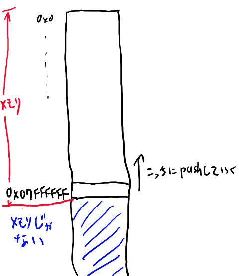
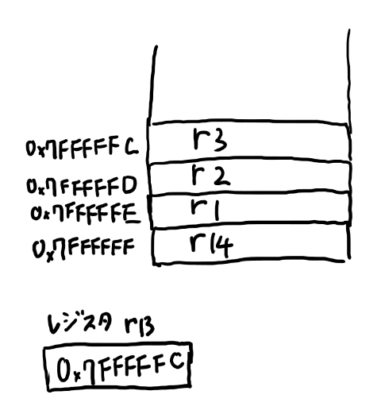

<style>
   .column{
        padding: 0.5em 1em;
        margin: 2em 0;
        color: #5d627b;
        background: white;
        border-top: solid 5px #5d627b;
        box-shadow: 0 3px 5px rgba(0, 0, 0, 0.22);
    }
</style>


第二回はQEMUを使ってARMのバイナリを動かしたり、バイナリを生成したりディスアセンブルしたりするコードを書きます。

OSの無い環境でプログラムを動かす事で、C言語の土台の理解を深める事を目的とします。

- QEMUのベアボーン環境を使えるようになる
- readelf, objcopy, objdumpなどのコマンドに慣れ親しむ
- 簡単なARMのアセンブリを理解する
- 簡単なアセンブラとディスアセンブラを作る

# 何故アセンブラと逆アセンブラを作るのか？

C言語を勉強しよう、という時に、なんだか関係ない別の言語に見えるアセンブラ言語を学ぼうというのは「なんでよ！？」と思うかもしれません。

そこでここではまず、今回QEMUを使ってバイナリを動かしたり簡易アセンブラや逆アセンブラを作るモチベーションを説明したいと思います。

### C言語を理解するにはアセンブリを知っている方がいい

C言語はアセンブリ言語を知らなくても理解出来ます。
ですが、C言語はアセンブリ言語との親和性が高く、アセンブリ言語の理解があるとずっと出来る事も増えます。

また、初めて低レベルな事をやる時にはobjdumpやobjcopyなど多くのコマンドが一気に出てきて、
実際は大した事無い事でもなんだかすごく圧倒されてしまいがちです。
一度どこかで簡単な題材に対してobjdumpなどを使った経験を持っておくと、
そうした時にもひるまずに済みます。

### バイナリの処理の勉強になる

C言語に一番向いた処理、というのはバイナリを扱う処理だと思います。
逆アセンブラやアセンブラなどはバイナリ処理の代表的な構造を持っているので、
バイナリ処理の練習に適しています。

バイナリ処理はだいたい似たような構造となるので、どれか一つでやった事があるかどうかの差は大きい。
そういう訳でバイナリ処理の題材として手頃なのでやってみよう、というのがあります。

### 低レベルなプログラムは楽しい！

C言語の楽しさといえば低レベルプログラミングでしょう。
低レベルプログラムは、C言語の楽しさの割と中心的な所だと思います。（著者の個人的見解です）

特に規模の小さい低レベルプログラムが楽しい。
規模の小さい低レベルプログラミングは隅から隅まで理解出来ます。
これはプログラムにおいて低レベルプログラムだけでしか味わえない楽しさです。

一方で最近は低レベルでも皆大きなものを作りたがりがちで、
本などを買って来て読んでも、あまりこの楽しさは味わえません。
やはり簡単な例でバイナリを隅から隅まで理解する、というのは、
C言語を学ぶなら一回くらいやっておいてもいいでしょう。

### 何故ARMなのか？

最初x86でこの回を作る気だったのですが、x86のアセンブリ言語は歴史的事情からいろいろ複雑な仕組みになっている為、説明がややこしくなります。

一方ARMはいろいろな事が単純になっている為、低レベルの事を勉強するには手頃なターゲットとなっています。
また、C言語を書く必要があるシチュエーションではARMをターゲットにする方が今ではむしろ多いと思うので、実用性という観点からもARMを覚えておくのは悪くない、と思いARMをターゲットとしました。


# 01 QEMUの環境を作ろう

以下Windows 10のWSLを前提にします。昨今ではたいていの環境で似たり寄ったりのパッケージシステムがあるでしょう。

初回は環境設定を主な目的としています。これらが何を意味しているかについては、おいおい説明していきます。

### QEMUとARM用gccをインストール

今回はARM用のQEMU環境であるqemu-system-armと、ARM用のクロスコンパイルのためのパッケージであるgcc-arm-embeddedをインストールします。

```
sudo add-apt-repository ppa:team-gcc-arm-embedded/ppa
sudo apt update
sudo apt install gcc-arm-embedded

sudo apt install qemu-system-arm
```

### バイナリエディタをインストール

今回はバイナリの中身を調査する為、何らかのバイナリエディタを入れる事がオススメです。
大したサイズじゃないのでodコマンドなどで頑張ってもいいんですが、
今回はバイナリエディタをインストールする事にします。

なんでもいいんですが、私は最近はBz Editorに落ち着きました。

https://github.com/devil-tamachan/binaryeditorbz

試しに以下で出来るhello_arm.binをバイナリエディタで開いてみて下さい。

### hello_arm.sを動かしてみよう

sources/arm_asm/01_qemu_setup/hello_arm.s

に、UARTにhelloと表示するアセンブリが書いてあります。これを動かしてみましょう。

```
$ arm-none-eabi-as hello_arm.s -o hello_arm.o
$ arm-none-eabi-ld hello_arm.o -Ttext 0x00010000 -o hello_arm.elf
$ arm-none-eabi-objcopy hello_arm.elf -O binary hello_arm.bin
$ qemu-system-arm -M versatilepb -m 128M -nographic -kernel hello_arm.bin -serial mon:stdio
```

終了はC-a xです。

# 02 ARM アセンブリ入門

さて、前回はhello_arm.sというアセンブリ言語で書かれたプログラムを動かしました。
今回はこのアセンブリ言語について、簡単な入門をしていきたいと思います。

ARMのアセンブリの入門なんてweb上にいくらでもありそうだと思うのですが、どうもググっても手頃なのが見つからないので、自分で書く事にしました。

**アセンブラ？アセンブリ？**  
まず正しい定義としては、アセンブリ言語が正しい呼称でしょう。
そしてアセンブリ言語をバイナリにする為のツールがアセンブラとなります。
コンパイルする言語がコンパイラなのと同様です。  
　  
ただ最近の若い人は普通にアセンブラ、と言いますよねぇ。アセンブリ、とわざわざいうのはどっちかと言えば頭の硬いおっさん、って感じがして、どうなのか、という気もします。
この手の語源警察とかろくでも無い、と普段から思っているので。  
　  
ただ他人がアセンブラと言っているのは別に良いのですが、どうしても自分が言語の名前をアセンブラと呼ぶのには抵抗があるので、このシリーズではアセンブリと呼ぶ事にします。おっさん乙…
{: .column}

## アセンブリについての話題など

まずは言語自体の話に入る前に、周辺の雑談などからしてみたいと思います。
というのはアセンブリ言語というのはちょっとそれ以外の言語とは違う所が多いと思うからです。

実際のお勉強を重視する人は読み飛ばしてOKです。

### アセンブリ言語は難しい？簡単？

アセンブリ言語は、ソフトウェア開発者だとだいたいtwitterでイキるのに使われる程度です。
いわく「Cはマクロアセンブラにすぎないから（キリッ」とか、「低レベルな方がわかりやすいので、ポインタが分からない人はアセンブリを先にやるとすぐ分かるよ（キリッ」とかそういう感じです。鬱陶しいですね。
彼らは別にアセンブリ自体の話はあんまりしない。

だいたいイキるのに使われるというのは、難しくて高度な事、という印象があるのでしょう。
実際、ソフトウェア開発者にとって、アセンブリ言語を理解するのは、難しい部分があります。

一方でアセンブリ言語が難しいか？というとそうでもありません。
あくまで「ソフトウェア開発者にとって」難しいのであって、
それ以外の人にとってはそんな難しくない、という事があります。
具体的にはハードウェア開発者などにはアセンブリ言語の方が簡単でしょう。

これはアセンブリ言語が、より抽象度が低いからです。下のハードウェアに近いので、下のハードウェアの知識があると、言語自体は大した事をしてないので理解が簡単です。

ハードウェアの知識、なんてなんか高度で難しそう！と思うかもしれませんし、
実際高度で難しいと思いますが、アセンブリ言語が難しい、というのはちょっと違う気もする。

抽象度が低い、というのは、思考としては逆に高度「では無い」という事だと思います。
この高度な思考を「捨てる」のが、高度で抽象的な思考に慣れているソフトウェア開発者にとってはちょっと難しい、
というか珍しい必要性を要求される所で、そこがアセンブリ言語の特殊さでもあります。

ただ抽象的じゃない、というのは、理解してしまえば難しさはそれほどはありません。
実際、アセンブリ言語「しか」理解出来ないという人は結構います。
ただそういう人はだいたいもう老人でweb上にはあんまり居ないので、

アセンブリ言語が出来る人＝＝そのほかの事もなんでもしってるすごい人

になりがちというだけです。

### アセンブリ言語は言語なのか？

C言語はプログラム言語です。これは皆が納得する事でしょう。
RubyでもPythonでもJavaでもKotlinでも、これらがプログラム言語なのは明らかで、
このプログラム言語についてある程度は説明する事も出来ます。

ですが、アセンブリ言語、というのは、「これがアセンブリ言語です」という意味でのアセンブリ言語は無い。
実際は「ARMのアセンブリ言語」とか「x86のアセンブリ言語」とかになります。
（さらにNASMとかgasとかありますが、それはおいとく）。

アセンブリ言語という単体の物は実際には存在していません。
それぞれCPUごとに別々の言語があります。
そしてこれらの言語は、CPUの機能を、ほぼそのまま書いているだけだったりします。
だから、あるCPUの機能を理解する事と、アセンブリ言語の理解は、ほぼ同じ事を指します。

ここがアセンブリ言語の特殊な所です。プログラム言語単体だけでの理解、というのがアセンブリ言語は出来ない。
逆にCPUの構造を理解するとアセンブリの理解も98%くらい終わってしまいます。
だからアセンブリ言語を勉強しよう、という時は、CPUの機能を勉強しよう、という事と同じなのです。
そしてCPUはそれぞれ別なので、どのCPUを勉強するか、という話になります。

言語という名前がついているけれど、実際はCPUの機能とほとんど同じ、という所がアセンブリ言語の特殊な所です。
CPUの機能とは独立した、抽象概念としての言語の実在があまり無い。
だから「とりあえずアセンブリ言語の基礎的な事だけ知りたいんだ。個々のCPU的な話には踏み込まずに解説している物は無いかな？」という気持ちで本屋やwebを探しても、全滅する事になります。

ただ、実際はいろいろなCPUは、それぞれかなり似通っています。
だから、一つのCPUを理解すると他のCPUも比較的簡単に学ぶ事は出来ます。
ですから、一つのアセンブリ言語を知っていると、アセンブリ言語を知っている、と言えない事も無い。

なお、このシリーズでは以下、特に指定無く「アセンブリ言語」と言ったら、ARMのアセンブリ言語を指すとします。

### アセンブリ言語は突然膨大な詳細情報が出てきがち

アセンブリ言語というのは、CPUを動かす為のバイナリと一対一に近い対応をしています。
完全に一対一では無くて、多対一で、アセンブリ言語の方が多ですが。
逆像は存在するので、どれかの元を選ぶ事で、逆アセンブルが出来る。

さて、CPUを動かすバイナリ、とは、要するにCPUにつながっている線のすべての電圧の組となります。
基本的には前のクロックに特定の電圧の組があると、次のクロックではある一定の電圧の組に変える、
というのがCPUの機能です。
この対応は完全に一意で、入力時の電圧を決めると、次のクロックは完全に決まります。

だから、原理的にはこの対応関係を全部記述すれば、分からない事はありません。
そこでアセンブリ言語のマニュアルというのは、
ある程度構造化された形でこの全対応を書いてあるものです。

これを調べれば全てが分かる。必要な事は全て書いてあって要らない物は無い。
素晴らしい。

これが他の言語を知っているソフトウェア開発者には辛い所です。
大量の詳細な情報がぶわーっと一気に出てくる。
ゆとりとしては、もっとこう、基礎的な所だけでまずはハローワールドとか書きたいのですが、
アセンブリ言語の情報というのは最初から全てを含んだpdfのみ、となりがちです。

そもそもにアセンブリ言語には説明すべき抽象概念があまり無く、
そこにあまり抽象的思考とかしないハードウェア開発者が書くという事があいまって、
ひたすら詳細が並んでるだけ、となってしまうのです。

そして実際、慣れてしまえばこれだけで十分でもあります。

結果として、大して難しくは無いのだけどとっつきにくい為、twitterでイキるのに使われてしまったりする。
悲しい事です。

### このシリーズでは、C言語に必要な程度だけ話す

私はそもそも、そんなにアセンブリ言語詳しくありません。
C言語を理解するには十分な知識を持っているつもりですが、ハードウェア屋とか低レベルプログラマの人たちに比べると、
だいぶ理解は浅い。

そこで今回も、アセンブリ言語のシステマティックで全体的な入門を書く気はありませんし、書く能力もありません。
その代わり、C言語の理解を深めるのに必要な範囲+アルファくらいの解説に留めようと思います。
ソフトウェア開発者にとってはアセンブリ言語の良い入門にもなると思いますが、
ちゃんと学ぶ時にはよそでお願いします。

ただ、この目的を絞っている方が、最初に全ての詳細が出てきてしまう、
という問題を回避出来るんじゃないか、と思っていますし、
解説としてもゆとりにも優しい感じを目指していきます。


## hello_asm.sを読む

ではhello_asm.sを読んでいく事で、アセンブリ言語の説明をしていきたいと思います。

まずはコードを見てみましょう。

```
.globl _start
_start:
    ldr r0,=0x101f1000
    mov r1,#0x68
    str r1,[r0]
    mov r1,#0x65
    str r1,[r0]
    mov r1,#0x6c
    str r1,[r0]
    mov r1,#0x6f
    str r1,[r0]
    mov r2,#0x0D
    str r2,[r0]
    mov r2,#0x0A
    str r2,[r0]
loop:
    b loop
```

開幕はむしろ難しいのがアセンブリの勉強の難しい所ですね。
個々の説明に入る前に、全体的な話から。

### 行の3つの種類

アセンブリ言語の行は、大きく3つの種類の行に分けられます。

1. 疑似命令（.で始まる。この例では.global _startだけ）
2. ラベル （文字列のラベルとコロンで指定される。この例だと_start:とかloop:とか）
3. 命令（実際のコード。movとかldrとかの行）

疑似命令はバイナリを生成する時に使われる特殊な物で、CPUの命令とは違う物です。
バイナリデータを埋め込んだり生成されるバイナリのアラインメントを調整したり、
といった、生成されるコードについての指示が主に行われます。

ラベルはジャンプ文などで参照する為の物です。最終的に生成されるバイナリには含まれません。
アセンブリ言語からの参照の目的で使われます。

最後の命令の行が、実際のCPUの命令になります。これがアセンブリ言語の本体です。

アセンブリのプログラムは、基本的には最初の命令から一つずつ実行されていきます。
ラベルがあっても関係なく次の命令に行きます。ここはちょっと慣れが要る所ですね。

### 命令の3つの種類

命令には大きく

1. レジスタとメモリの間のデータのやり取り
2. レジスタ同士の計算
3. ジャンプ

の3つがあります。

さて、レジスタというのが出てきました。初めて見る人も居るでしょう。
レジスタというのはCPUに直接つながっている、32ビットの数値を覚える領域、という感じです。
アセンブリプログラムからすると、レジスタというのはintのグローバル変数のような物です。
CPUごとに数が決まっていて、ARMではとりあえず16個のレジスタがあります。
これにはrで始まる名前がつけられていて、
r0からr15までの名前で識別出来ます。
（本当は他に状態フラグ用のレジスタもありますが、これは直接は触れないのでここでは考えません）

アセンブリ言語が一番変わってるのは、メモリの値に対しては、直接計算する事が出来ない所です。
アセンブリ言語においては、メモリは非常に遠くのデータベースのような存在で、
まずデータをレジスタに取ってきてからじゃないと使えません。

そこでアセンブリのプログラムは基本的に

- メモリから値をレジスタに移す
- レジスタ同士で計算する
- レジスタからメモリに値を戻す

という事を繰り返す事になります。

上記リストの1の、メモリとレジスタの間をやりとりするのがロードとストアです。
ロードはldr、ストアはstrという命令で表されます。strは文字列じゃないらしいです。
ロードでメモリから値を読み、ストアでメモリに値を書きます。
ゆとりな自分にはどっちがどっちか良くわからなくなります。

次にレジスタ同士の演算としては、このプログラムではmovしか使ってません。
これは引数を2つ取り、右側の値を左側にコピーする、という意味になります。
詳細は後で説明します。

最後はジャンプです。このプログラムではbという命令が使われています。
bは無条件にジャンプする、という事です。
このプログラムでは以下のようなコードで終わってますね。

```
loop:
    b loop
```

これはloopのラベルにジャンプする、という意味です。loopはまさにこの一行上なので、またこの行が実行されます。
つまりb loopが無限に実行されます。
C言語でいう所の

```
while(1){}
```

という意味ですね。ここで実行を止める事で、変な事をせずに待つ事が出来るようになります（高速にひたすらジャンプし続けるので電気的には無駄ですが）。


### movを簡単に見る

まずはmovを見てみましょう。例えばこんな行があります。

```
    mov r1,#0x68
```

movは普通は以下のように使います。

```
    mov r1,r2
```

これでレジスタr2の中身を、レジスタr1にコピーする、という意味です。

ですが今回のコードでは、このr2に相当する部分が、「#0x68」となっていますね。
この#で始まるのは即値と言われるもので、小さな数字はこうやって直接レジスタを入れる所にレジスタの代わりに置く事が出来ます。

「小さな数字」というのがどこまで許されるかは命令ごとに決まってますが、だいたい数ビットの範囲です。
なお、どこまで許されているかは私は覚えてないので適当に書いてアセンブル時に怒られたりするのは良くあります。

とにかく、以下の命令で、

```
    mov r1,#0x68
```

r1には0x68が代入されます。

### ldrを簡単に見る


さて、最初の命令はこんな行になっています。

```
    ldr r0,=0x101f1000
```

イコールで始まる物の意味はちょっとややこしいんですが、プログラムのバイナリの下の方にイコール以下の数字を書き込んで、
そこへのアドレスの中身とする、みたいな意味になります。

TODO:あとで調べてちゃんと書く

0x101f1000 は数ビットの範囲には収まってないので即値では書けません。
そこでmov命令で代入する事は出来ないので、一旦この数値をバイナリに埋め込んで、その埋め込んだアドレスを読むように指定する必要があります。

めんどくさいですね。

この辺は後で実際にバイナリエディタで中を見る時によりちゃんと理解出来ると思うので、
この時点ではとにかくそういう物らしい、くらいで先に進んで下さい。

とにかく、これでr0レジスタには「0x101f1000」という数字が入ります。

この数字は何か？というと、メモリマップされたUARTのアドレスです。
メモリマップってなんだよ、とかUARTってなんだよ、とかいろいろ一気に出てくるのがアセンブリの面倒な所ですね。

ちょっとずつ見ていきましょう。

### versatilepb入門

さて、この0x101f1000というのが何なのか、
というのは、現在ターゲットにしているハードウェアの話になります。

我々はQEMUにversatilepbという物を指定しているので、QEMUはこのハードウェアをエミュレートしています。

versatilepbというのは、自分もあまり詳しくないですがARM926EJ-SのCPUが載った評価ボードですかね。
ARM926EJ-Sは結構ライセンス料が安くてダイが小さいという事で、
非力なマシンにとりあえず載せておくCPUとして広く普及しています（2018年現在）。

詳細は以下のサイトにありそうです（私があまり詳しくない）

[https://developer.arm.com/docs/ddi0198/latest/preface](https://developer.arm.com/docs/ddi0198/latest/preface)

まぁとにかく、ARMでとりあえず何か作る時には仮想的なターゲットとしてとりあえず良く使われる物と思っておけばよろしい。

で、このversatilepbのアドレス0x101f1000には、UARTという物が接続されています。
これはメモリマップドIOという物ですね。

### メモリマップドIOとは何か？

TODO: あとでちゃんと調べて書く

一般にハードウェアというのは、CPUと何かしらの形でつながっています。
で、CPUはこのハードウェアにつながってる線に電圧を掛けたり抜いたりする事で命令を送って操作します。

このCPUとハードウェアをつなぐ時の方式として、メモリのふりをしてつなげる、という方式があります。
これがメモリマップドIOです。
CPUからは特定のアドレスのメモリのように見えるんですが、
実はこれはメモリでは無くハードウェアを制御する線になっている、という訳です。

プログラムからはこのメモリのアドレスに値を書き込んだり読み込んだりする事で、ハードウェアを操作します。
メモリからアドレスを書いたり読んだりするのはロードとストアを使う、という話をしました。
これを使います。

で、UARTは単純なシリアルポートの最近流行りのバージョン、くらいに思っておけばいいと思います。
ここに書いた物はそのままポートから取り出せて、ディスプレイなどにつなげると結果が見れたりします。
teratermとかkermitとか使います（たぶん）。

ゆとりの低レベルプログラムとしては、UARTはデバッグ出力出す所、と思っておけば良いでしょう。

で、versatilelpbのメモリ空間では、アドレス0x101f1000はURTにつながってる訳です。

なお、このアドレス以外のメモリマップドされてる物は、公式ドキュメントにも書いてありますがQEMUのソースを読む方が早い。

[github: QEMU versatilepb.c](https://github.com/hackndev/qemu/blob/master/hw/versatilepb.c)

### strを簡単に見る

最後に残ったのがstr命令ですね。例えば以下みたいな行があります。

```
    str r1,[r0]
```

ストア命令は、1つ目の引数の値を二つ目の引数のアドレスに書きこむ、という意味です。
r0が中括弧で囲まれているのは、「この中括弧で囲まれているレジスタの中身をアドレスとみなして、そのメモリのアドレスに書き込む」という意味の指定方法です。

こういうのは最初のうちは出てきた物だけ覚えて、ある程度慣れてきたら全ての指定方法を覚えるのがおすすめです。
最初は詳細情報が多すぎないように、出てきた物だけをコツコツと攻略していきましょう。

さて、r0は先程のロード命令で0x101f1000が入っているのでした。
だからこの命令で、r1の中身をアドレス0x101f1000に書き込む、という意味になります。

これで（疑似命令以外）だいたい全部の構成要素の説明が終わりました。では何が書いてあったのかを解読してみましょう。

### 文字の出力を解読する

ではまずは以下の三行を見てみましょう。

```
    ldr r0,=0x101f1000
    mov r1,#0x68
    str r1,[r0]
```

一行目でr0に0x101f1000が入ります。

2行目でr1に0x68が入ります。

三行目でr0のアドレスにr1を書き込みます。つまり0x101f1000に0x68を書き込みます。

このように、メモリの特定のアドレスに数字を書き込む、という事に、これだけの手順が必要になるのです。

ここまで来ると、以下のコードも読み解く事が出来ます。

```
    mov r1,#0x68
    str r1,[r0]
    mov r1,#0x65
    str r1,[r0]
    mov r1,#0x6c
    str r1,[r0]
    mov r1,#0x6f
    str r1,[r0]
    mov r2,#0x0D
    str r2,[r0]
    mov r2,#0x0A
    str r2,[r0]
```

0x68を書き込み、0x65を書き込み、0x6cを書き込み、0x6fを書き込み、0x0Dを書き込み、0x0Aを書き込む訳です。

あとはアスキーコードの知識となります。第一回でパーサー書いた時に調べたでしょうか？（私は調べてません）

確か順番に'h' 'e' 'l' 'o'と、0x0D, 0x0Aを書いているのでしょうね。
最後2つは改行だったはず。（改行と復帰だっけ？まぁどうでもいい）

TODO: .globalちゃんと調べて書く

これで最後に残るのは疑似命令ですが、ここは説明するとややこしいので、おまじないと思っておいてOKです。

_startというのはリンカあたりにとって特別な意味を持ってて、バイナリの先頭をそこに配置するという意味があります。
で、この.globalというのはラベルをアセンブリだけじゃなくて結果のバイナリにも残して、それをリンカから見えるようにする、という感じだったと思います。おいおい説明します。（たぶん）

### hello_asm.sを読み終わって

さて、いかがでしたでしょうか。こんな何もしてないアセンブリでもなかなか説明する事が多いですね。
抽象化が弱いせいで、最初から全部が出てきてしまうのがアセンブリの辛い所です。

ただ基本的なアセンブリの要素はここまででもかなり説明出来ています。
コードをメモリとのやり取りとレジスタ内での計算の2つに読み解ければ、アセンブリはマスターしたも同然です。
実際ハードウェア屋にアセンブリ教えて、って頼むと、
この位から一気に詳細のデータシートを渡されて「あとはこれ読むだけだ」とか言いがちです。

ですが彼らはゆとりの気持ちが分からない連中なので気にしてはいけません。
我らはもうちょっとちまちま進む事にしましょう。

### hello_asm.sに出てきたニモニックまとめ

アセンブリではPostScriptでオペレータと言っていた物をニモニックと呼びます。ニモニックの意味は知りません。

で、ここまで出てきた物を簡単にまとめておきます


| ニモニック | 例 | 説明 |
| ---- | ----- | ------|
| **.global** シンボル | **.global _start** | シンボルをリンカに見えるようにする疑似命令 |
| **b** ラベル | **b loop** | ラベルにジャンプする |
| **ldr** レジスタ, メモリ | **ldr r1, =0x101f1000** | メモリの内容をレジスタに読み込む。イコールで書かれた長い数値などはどこかに埋め込んでそこへのアドレスに展開される（からレジスタには=で書いた値がそのまま入る） | 
| **mov** 結果レジスタ, 入力 | **mov r1, #0x68** | 入力を結果のレジスタにコピーする。入力は即値やレジスタなどが使える |
| **str** 入力レジスタ, メモリ | **str r1, [r2]** | 入力レジスタの中身をメモリの指定された場所にコピーする。メモリの指定は中括弧でアドレスの入ったレジスタをくくるなど |


## print_loop.sを読もう

さて、hello_asm.sを極めた我々はアセンブリマスターとしてtwitterでイキる事が出来るようになりました。
しかし我らの志は高いので、そんな事では満足しません。

次にループのあるコードを読んでみましょう。

02_arm_assembly/print_loop.sを読んでみます。

まずは読む前に実行してみてください。
「hello, world」と表示されたでしょうか？

コードは以下のようになっています。

```
.globl _start
_start:
    ldr r0,=0x101f1000
    ldr r1,=message
    ldr r3,[r1]    
loop:
    str r3,[r0]
    add r1, r1, #1
    ldr r3,[r1]
    cmp r3,#0
    bne loop
message:
    .asciz  "hello, world\n"
```

では見ていきましょう。

### 疑似命令.asciz

まずは最後の行から。
最後のところに、出力している文字っぽい物が書いてあります。


```
message:
    .asciz  "hello, world\n"
```

このmessage:はラベルです。
.ascizというのは疑似命令ですね。

この.ascizというのは、その後の文字列をそのまま埋め込んで、最後にヌル文字（つまりバイト0)を入れる、
という物です。
埋め込むというのが何を指すのかは後でバイナリエディタで見てみる所まで行くとより詳細に分かると思います。

この時点では、アセンブリ言語で書かれたプログラムは、ほぼ一対一に対応したバイナリに書かれていき、
この疑似命令.ascizではその引数のバイナリがそのままそこに書かれる、と説明しておきます。
その前にラベルをつけておけば、このアドレスがこの文字列の始まりとなる訳です。

TODO: あとで実際のバイナリ値を出してこの説明を補完

なお、ここにジャンプするとこれはARMの命令でもなんでも無いバイナリなのにCPUがARMの命令として解釈しようとして、むちゃくちゃになります。

このように文字列をプログラムの最後に埋め込んでおき、その先頭のアドレスを以下の行で使っています。

```
    ldr r1,=message
```

イコールはそのアドレスの中身を読むんだったな、とか思うと、この場合は微妙に違くてmessageラベルのアドレスを表します。
あんまり深く考えずに、ラベルの時はアドレス、0x12345678とかの数字の時は、
その数字をどこかに書き込んでそこへのアドレスと思っておいて下さい。
この辺一貫性無い所が高度な抽象思考になれたソフトウェア開発者を幻惑するのです。（ほんとか？）

話を戻して。この場合はr1レジスタにはラベルmessageの所のアドレスが入ります。

### ldrでアドレスの中身を取り出す

以下のコードは、厳密にはまだ説明してませんが、だいたい想像出来るでしょうか？

```
    ldr r3,[r1]
```

ldrはロード命令という物で、メモリからレジスタに値を持ってくる為の命令でした。

中括弧で\[r1\]と書くと、「このr1に入っているアドレスの所のメモリの内容を取り出す」という意味になります。strの時と同じですね。

これでr3には何が入るかというと、messageラベルの所のアドレスに書かれた値です。それはこの場合'h'のアスキーコードになります。（0x68だったかな？）

つまりこれでメモリ上から一文字取り出せる訳です。

と書いてたけど、これだと一文字を下位8ビットに、残り24ビットに関係ない数字が入ってそうですね。
なんかldrbと間違っているような…

TODO: あとで確認、説明は8bit読まれるという前提で書く。

### ループのコード

次に以下のコードが実行されていきます。

```
loop:
    str r3,[r0]
    add r1, r1, #1
    ldr r3,[r1]
    cmp r3,#0
    bne loop
```

さて、アセンブリの難しい所は、この時点でどういう状態だったかは、前のコード見て覚えておかないといけない所です。
この時点では

- r0 ... UARTのアドレス
- r1 ... messageラベルのアドレス
- r3 ... 一文字目のアスキーコード

という状態でここのブロックに入ってきます。

で、一行目はhello_asm.sと同じコードになっていますね。r3の内容を、r0の指すメモリアドレスの中身として書き込む。
これはメモリマップドIOでUARTにつながっているので、その文字が出力されるのでした。

次の行は新しい。addですね。これは二番目と三番目を足した結果を一番目に入れる、という命令です。
この場合はr1に1を足している訳ですね。これでmessage:のラベルの所の次の文字のアドレスになります。
つまり'e'ですね。

その後にまた一文字r3にロードしている。つまり'e'をロードしています。

その次にcmpというのが出てきます。これは一番目と二番目の引数を比較し、等しければ1をある隠れた場所にあるフラグビットに入れます。
このフラグビットはcmpなどの比較演算で結果を入れる所として使われる所です。

そして次のbneは、条件付きジャンプです。フラグビットが0だったらジャンプします。
0じゃなかったらジャンプせずに、通常通り次の命令に進みます。

cmpの後に特に変な事をしなければ、cmpの結果がnot equalだったらbranchする、という事ですね。
branch not equal、略してbne。

第一回で作ったjmp_not_ifと同じような物ですね。（むしろあちらをbneを参考に考えたのだけど）

以上から、以下の二行は合わせて、

```
    cmp r3,#0
    bne loop
```

「r3が0じゃなければloopラベルにジャンプ」という意味になります。

つまり読み込んだ一文字が0以外だったらジャンプする訳ですね。0は文字列の終わりを表しているので、0だったらループせずに終わります。

第一回でやった、eqをしてからjmp_if_notするのと似てますね。
ただ第一回ではeqの結果はスタックに積まれましたが、
ARMのアセンブリ言語では結果はどこかの謎のフラグビットに保存される所が違いです。

ただcmpで結果を作って、その結果に基づいてbneする、という流れは本質的には同じです。

TODO: あれ？この後ビジーループで止めないと駄目なような。後で実機確認

以上で、文字列を一文字ずつ出力する、というコマンドを説明しました。

- .ascizで文字列を埋め込む。その前にラベルをつけてそのアドレスを使う。
- addは二番目と三番目を足して一番目に入れる
- cmpは一番目と二番目を比較して、等しければTODOレジスタに入れる
- bneはTODOレジスタが0だったらジャンプする

このようにcmpとbneを使ってループを作れます。addを使ってインデックスを進められます。


### print_loop.sに出てきたニモニックまとめ

| ニモニック | 例 | 説明 |
| ---- | ----- | ------|
| **.asciz** 文字列 | **.asciz "hello"** | 文字列とその後にヌル文字をその場に埋め込む疑似命令。ラベルと合わせて使う。 |
| **cmp** レジスタ1, レジスタ2 | **cmp r1, r2** | レジスタ1とレジスタ2を比較し、等しければ1を、等しくなければ0を条件フラグに書き込む |
| **bne** ラベル | **bne loop** | 条件フラグが1でなければラベルにジャンプする |

## print_hex.sを作ろう

ここまでは既にあるコードを読んできましたが、自分でも書いてみないと良く分からないですね。
そこで、レジスタの値を16進数表記でprintするコードを書いてみましょう。

16進表記とは0x000012FAとかそういうのです。0xで始めて0〜9とA〜Fまでのどれかで一桁を表します。

print_hex.sというファイル名のTODOを埋めて見てください。

### 基本的なロジック

まずどんな事を実装するかを考えてみましょう。
16進数得意なら説明無しで分かると思いますが、私はゆとりなので16進数良く分からない系男子です。
そこで16進数の話を簡単にします。

表示したい対象がr1に入っているとします。

r1は32ビットです。32bitを16進数に直すには、4bitずつに区切るとわかりやすい。
32は書くのが面倒なので以下16ビットの場合を書きます。16ビットが理解出来ていれば32bitもほぼ同じなので。

例えば2進数で適当な16ビットの数を書きます。以下だったとします。

```
1110000111100011
```

この時、まずこれを4桁ずつで区切る。

```
1110 0001 1110 0011
```

で、その各4桁を、0〜Fまでの数字に換算する。

```
E 1 E 3
```

うわ、適当に書いたらEが2つだった…まぁいいです。
これが16進表記になる訳ですね。つまりこの数字は0xE1E3でした。

この実装を考えるには、

1. 目的の4bitを下4bitまでシフトで持ってくる
2. 0x0Fとビットワイズのアンドをとる
3. 0〜15までの数字を、対応するアスキーコードで表示する


を各桁でやれば良さそうです。
3はアスキーコードをググれば出来るでしょう。そこであとはシフトとアンドができればこれを実装出来そうです。


### LSRとAND命令

右にシフトするのは、logical shift rightと呼ばれてLSRというニモニックになっています。
以下のコードでr2の値を右に2ビットシフトしてr1に入れます。

```
LSR r1, r2, #2
```

バレルシフトの解説はここでは要らないか？後で考える。

ANDはそのままANDというニモニックです。
以下のコードでr2と7をandした結果をr1に入れる。

```
AND r1, r2, #0x07
```

これくらいで書けますかね？一旦書いてみてコミットして見せください。


## メッセージを表示する、printを作ろう

ここでは、アセンブリ言語で、C言語の関数と同じ事をするコードを書いてみたいと思います。
まずはスタックが必要の無い関数から作ってみます。

### 作りたい物

まずは簡単に、r0に文字列のアドレスが入っているという前提で、結果をUARTに出力する、printという関数を作ってみたいと思います。


### 前回のループをアレンジ（不完全版）

前回のprint_loop.sのloopはかなり近い物でした。
例えば以下のように書いておけば、ほとんど関数のように使えそうです。

```
print:
    ldr r3,[r0]
    ldr r1,=0x101f1000
loop:
    str r3,[r0]
    add r0, r0, #1
    ldr r3,[r0]
    cmp r3,#0
    bne loop
```

例えば以下のように使えます。

```
    ldr r0,=message
    b print
```

ただ、これだとmsg1とmsg2という2つのメッセージがあった場合に、以下のようには書けません。

```
    ldr r0,=msg1
    b print
    ldr r0,=msg2
    b print
```

二行目のb printした後に、戻ってくる事が無いのでその次の行に行かないのです。

このように、関数としての機能を実装するには、何か仕事をした後に「呼び出し元に戻る」という機能が必要です。

これで必要になるのがblですが、その前にプログラムカウンタについて話をしておきましょう。


### ジャンプとプログラムカウンタとr15

ARMではr15はプログラムカウンタと呼ばれる特別なレジスタになっています。
プログラムカウンタは、大雑把には次に実行する命令のアドレスを入れておくレジスタ、と言えます。

だからr15にどこか別のアドレスをえいっと入れると、CPUはそこにジャンプして次はそこから先を延々と実行する、という振る舞いをします。
b命令でも同じ事が出来ますが、r15にアドレスを入れても同じ意味になるんですね。

で、現在実行中のアドレスはr15に入っています。（歴史的な事情で本当は現在実行しているアドレスの4くらい先が入っているのでここのコードはそれを調整する必要がありますが、実際はblを使うのでそこは無視します）。

TODO:あとでずれてる数字を確認

という事で、例えばr14を戻り先として、

```
mov r14, r15
b print
```

とする決まりにして、printの最後で、

```
print:
    ...
    mov r15, r14
```

とする決まりにすれば、呼び出し元に戻る事が出来ます。

つまり使う側のコードは以下のようになります。

```
    ldr r0,=msg1
    mov r14, r15
    b print
    ldr r0,=msg2
    mov r14, r15
    b print
```

このように毎回r0に渡したい文字列のアドレス、r14に戻り先のアドレスを入れればいいのですね。

この現在位置をどこかに入れてジャンプし、作業が終わったら戻ってくる、というのは非常に良くやる事なので、
ARMではこれを一度に行う専用命令があります。

それがblです。


### blで関数呼び出し

blはbranch with linkの略らしいです。
blは現在のアドレスの次の命令のアドレスをr14に入れてからジャンプする、という命令です。
だから上記のb printの代わりにbl printとすると、r14にはこのblを呼んだ場所の次の命令のアドレスが入ります。

blはr14に決め打ちでアドレスを退避します。だからblを呼ぶ人は、その前に入っているr14の値が必要なら、一時的にどこかに保存しておく必要があります（上書きされちゃうので）。
r14はblにこの目的で使われるのでリンクレジスタという名前がついています。
ただbl以外も普通にこのレジスタは使ってOKです。

で、関数は用事が終わったらこのr14に戻れば良い。
つまり mov r15, r14すればいい訳ですね。

このblを使えば、使う側のコードは以下のように簡略化出来ます。


```
    ldr r0,=msg1
    bl print
    ldr r0,=msg2
    bl print
```

これは引数をr0に入れてblを呼ぶだけなので、だいぶわかりやすいと思います。

これで関数を実装出来ました。


## スタックを使ってローカル変数もどきを作ろう

さて、blを使う事で何か作業をした後に呼び出し元に戻る、という事は出来るようになりました。

ですがこれだけでは、ネストした呼び出しに対応出来ません。
例えば、一文字出力するputcharと、それを使ったprint2を作る場合考えていきましょう。


### 何も考えずに実装すると何が起こるか

まずはあえてそのまんま実装してみましょう。

まずputcharにはUARTのアドレスに文字を書き込むとします。

```
putchar:
    ldr r1,=0x101f1000
    ldr r0, [r1]
    mov r15, r14
```

毎回r1にUARTのアドレスを入れるのはちょっと無駄な気もしますが、まぁいいでしょう。

次にこれを使ったprint2を作る事を考えてみます。
もともとのprintをコピペしてきてちょこちょこっと変えれば出来そうかな？

まずはコピペしてみましょう。

```
print:
    ldr r3,[r0]
    ldr r1,=0x101f1000
loop:
    str r3,[r0]
    add r0, r0, #1
    ldr r3,[r0]
    cmp r3,#0
    bne loop
```

ふむ。r1に一旦入れているのはputchar側にあるので消して、blすれば良い？


```
print2:
    ldr r3,[r0]  // r3に一文字読み込む
loop:
    /*
    str r3,[r0]
       この行はコメントアウト。これをputcharに変えたい。
       つまりここでどうにかしてr3の内容をputcharで表示したい。
    */
    add r0, r0, #1
    ldr r3,[r0]
    cmp r3,#0
    bne loop
```

えーと、putcharを呼ぶにはr0に文字を入れてbl putcharすれば良い。
でも今は一文字目はr3に入っているな。
という事で

```
mov r0, r3
bl putchar
```

とすれば良いのか？とやってしまうと、
今r0に入っている現在の文字のアドレスがどっかに行ってしまいます。

じゃあr0はどっかに入れておかないと駄目か。という事でr1に入れると、
今度はputcharの中でUARTのアドレスに上書きされてしまう。

マジかよ、という事でr2に入れないと駄目そうです。

```
print2:
    ldr r3,[r0]
    mov r2, r0
loop:
    mov r0, r3
    bl putchar
    // 以下はr0をr2に変えるだけ
    add r2, r2, #1
    ldr r3,[r2]
    cmp r3,#0
    bne loop
    // 最後にリンクレジスタに戻る
    mov r15, r14
```

なんか無意味に一旦r3に入れた後にr0に入れてる気がしますが、無駄なだけで動きはするはずです。

これで良いでしょうか？
これだとbl putcharを呼んだ時にr14が上書きされてしまっています。

```
    ...
    // ここでr14が上書きされてる！！！
    bl putchar
    add r2, r2, #1
    ldr r3,[r2]
    cmp r3,#0
    bne loop
    // このr14はprint2を呼んだアドレスじゃなくなってる！！！
    mov r15, r14
```

なんてこった。という事で、bl putcharを呼ぶ前に、r14は別の場所にとって置かないといけなさそうです
r1はputcharで使っていてr2はさっき使ったのでr3...も別の用途で使ってそうなので、r4でしょうか。


```
print2:
    ldr r3,[r0]
    mov r2, r0
    mov r4, r14 // ！！！New ！！！
loop:
    ...
    // 最後に呼び出し元に戻る。r4に入れていた
    mov r15, r4
```

このレジスタがどこで使われててぶつからないか、とか考えなきゃいけないのがアセンブリ言語が大変な所です。
さて、r3は不要な事を考えて整理すると、最終的には以下みたいな感じでしょうか。


```
print2:
    mov r2, r0
    mov r4, r14
    ldr r0,[r2]
loop:
    bl putchar
    add r2, r2, #1
    ldr r0,[r2]
    cmp r0,#0
    bne loop
    mov r15, r4
```

これでどうにか動くように出来ました。

### このやり方の問題点

さて、わざわざ説明するまでも無く、これは結構やばそうな感じです。
print2からputcharを呼ぶだけで、両者で何が使われているか、とか気をつけないといけません。
さらに外からprint2を呼ぼうとすると、今度はr4がすでに使われているからr5を使う、とかやっていかないといけませんし、
これでは原理的にも15個くらいネストすると限界が来てしまいます。
これは本質的には第一回でやったXX, YY, ZZ呼び出し問題と同じですね。

何より、関数を呼ぶ側と関数の両方を考えてレジスタがぶつからないようにしないといけないので、メンテも大変です。

そこで普通、関数でレジスタを使う時は、一旦メモリに退避します。

### versatilepbのメモリマップ

これまでメモリマップされたIOに値を保存した事はありましたが、
本当のメモリを使った事はありませんでした。

という事でここで普通のメモリの使い方を見てみます。

まずOSが無い場合、メモリというのはアドレスに普通にマップされています。
versatilepbのメモリマップはここを見ると以下のようになっています。

TODO:参照先調べる

- 0x0-0x03FFFFFF 64MB SDRAMの下位64MB
- 0x04000000- 0x07FFFFFF SDRAMの上位64MB
- 0x08000000- 0x0FFFFFFF 128MB 予約済み領域（拡張メモリをここに置く事もあり）

つまり最初の128MBはメモリとして普通につかえて、128MBから256MBまでは使ってはいけない領域として決められているようです。

0x0がメモリとして読み書きできるのはちょっと怖いですね。ヌルポインタに間違って書いても気づか無さそう。
（あとで動作確認）。
でもOS無しの環境なんてそんなもんです。

さて、この0〜128MBには値を保存したり後から読み出したり自由に出来ます。


### メモリをスタックとして使う

メモリの適当な範囲を関数呼び出し用のスタックとして使いましょう。
スタックは適当なアドレスからアドレスを増やして使っていっても、適当なアドレスからアドレスを減らしていって使っても実現出来ます。
アセンブリとしてはどちらでも構わない。

ただ、ARMのC言語の標準としては減る側に使う事になっています。
ですから使えるメモリの一番大きい所、つまり128MB目にあたる0x07FFFFFFから順番に値を詰めていくようにしましょう。

スタックというと第一回でも作ったように、現在どこまで値を詰めたか、を表す物が必要になります。
これはスタックポインタという名前がついていて、ARMのC言語標準としてはr13を使う事になっています。
アセンブリ的には他のレジスタでもOKですが、他を使う理由も無いのでここでもr13を使っていく事にしましょう。



まず、r13には境界としてこの一つ先を指しておく事にしましょう。つまり以下のようなコードを実行しておく前提で以後話をします。

```
ldr r13,=0x08000000
```

なんで一つ先を指すのかはのちほど説明しますが、ARMのC言語標準がそうなっているからです。


### strとldrでスタック操作を実装してみる

さて、r13には現在のスタックのトップのアドレスが入っています。
ここにblで使うレジスタr14をpushしたい場合、C言語だったら以下みたいなコードになってたと思います。

```
stack[pos++] = r14;
```

今回posは一番大きい所を指してそこから減らしていくので、イメージとしては以下のようなコードになっています。


```
int stack[STACK_SIZE];
int pos = STACK_SIZE;
```

ではpushはというと以下みたいな感じでしょうか。

```
stack[--pos] = r14;
```

先にposを減らしてから値を入れる事になります。

同じような意味の事をアセンブリで書くと、以下のような感じでしょうか。

```
sub r13, r13, #1
str r14, [r13]
```

これで、スタックの先頭にr14の中身をコピーする事に成功しました。
やりたければ他のレジスタも同じ感じで保存出来ます。

r1, r2, r3を保存するとしたら、以下みたいなコードです。

```
sub r13, r13, #1
str r1, [r13]
sub r13, r13, #1
str r2, [r13]
sub r13, r13, #1
str r3, [r13]
```

この時点でのスタックとレジスタの中身は以下のようになります。



r13が最後の要素のアドレスを指してて、pushする前にデクリメントする、というルールにしている訳ですね。
subしたあとにstrする。この順番は後で重要になってくるので注目しておいてください。

さて、取り出す時は逆順に取り出していく事が出来ます。スタックですからね。
以下みたいなコードになります。

```
ldr r3, [r13]
add r13, r13, #1
ldr r2, [r13]
add r13, r13, #1
ldr r1, [r13]
add r13, r13, #1
ldr r14, [r13]
add r13, r13, #1
```

ldrしたあとにaddする訳ですね。
このように、sub+strでプッシュが、ldr+addでポップが実装出来ます。

この操作はC言語ではすごく良くあるので、これと同じ事を一発でやる専用命令があります。
それがLDMIAとSTMDBです。

### LDMIAとSTMDB

r13の指しているアドレスのメモリに、ロードしたりストアしたりする。
複数レジスタを一気にストアするstore multipleの略のSTMと、そのロード版のLDMがある。

まとめてロードしたりストアする時には、一つずつアドレスを進めてストアしたりしたい。
そこで一つストアする事とアドレスをどう進めるかのくみあわせをDBとかAIとかで指示する。

DBはdecement beforeで、保存する前にdecrementしてから保存する、という意味。
IAはincrement after。
この2つは対応して使う必要がある。
STMDBとLDMIAの2つだけ覚えれば良い（なおLDMと何も指定しないとLDMIAと同じ意味なので、STMDBとLDMという人もいる）。

まずは以下の式が何を意味しているかを覚える。

```
stmdb r13!, {r0-r5}
ldmia r13!, {r0-r5}
```

writebackやレジスタリストの説明はその後やる。

### レジスタリスト

```
{r0-r5}
```

みたいに、中カッコでくくってレジスタをいくつか書くのをレジスタリストという。

### writeback

レジスタの後ろにエクスクラメーションマークをつけるのを、writebackという。
r13!みたいなの。

これをつけると、stmやldmでアドレスを進めた後に、最後のアドレスをr13に書き戻してくれる。
つけないとr13にはもとの値のまま。

普通はスタックに物を詰めたらposを進めたいのでビックリマークつける。


### pushとpop

ARMにはなぜかpushとpopというシンタックスシュガーがある。

```
stmdb r13!, XXX
ldmia r13!, XXX
```

と

```
push XXX
pop XXX
```

は同じ意味。pushはr13とDBを決め打ちにしたstm。と言える。popも同様。

だからr13をちゃんと設定しておくと、以下のコードで

```
push {r0-r5}
```

レジスタのr0〜r5までをスタックとして使ってるメモリに保存し、
以下のコードでそれをスタックからレジスタに取り出す。

```
pop {r0-r5}
```

なお、どちらもr13を更新します。

# 03 アセンブリからC関数を呼ぶ

最低限のセットアップだけで関数を呼ぶ。リンカの使い方とかも。

# 04 リロケーションとリンカスクリプト

hello_arm.o, hello_arm.elf, hello_arm.binのバイナリを比較して、リロケーションの話を簡単に。
逆アセンブルもこの辺か。

# 05 簡易アセンブラを作ろう

リロケーション無しで簡単なアセンブリを作る。0x00010000決め打ち。


----

以下メモ


```
arm-none-eabi-objdump -S hello_arm.o
```

versatilepbはARM926EJ-S。
https://developer.arm.com/docs/ddi0198/latest/preface

ただデータシートの4章くらいが今回程度の知識なら妥当な気がする。
https://developer.arm.com/docs/ddi0027/latest/arm7di-data-sheet


C function call
https://developer.arm.com/products/architecture/cpu-architecture/a-profile/docs/ihi0042/e/procedure-call-standard-for-the-arm-architecture


versatilepb memorymap
https://github.com/hackndev/qemu/blob/master/hw/versatilepb.c